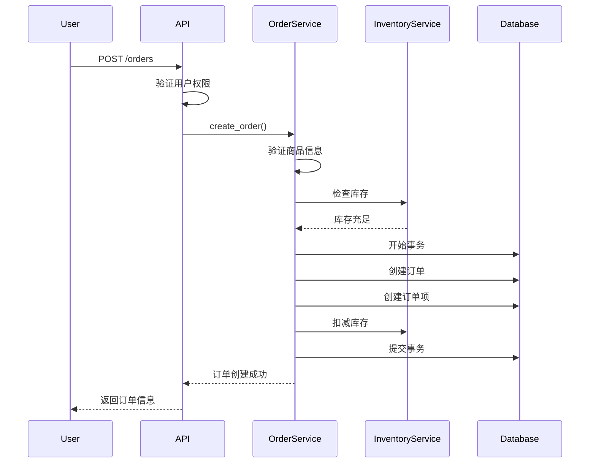
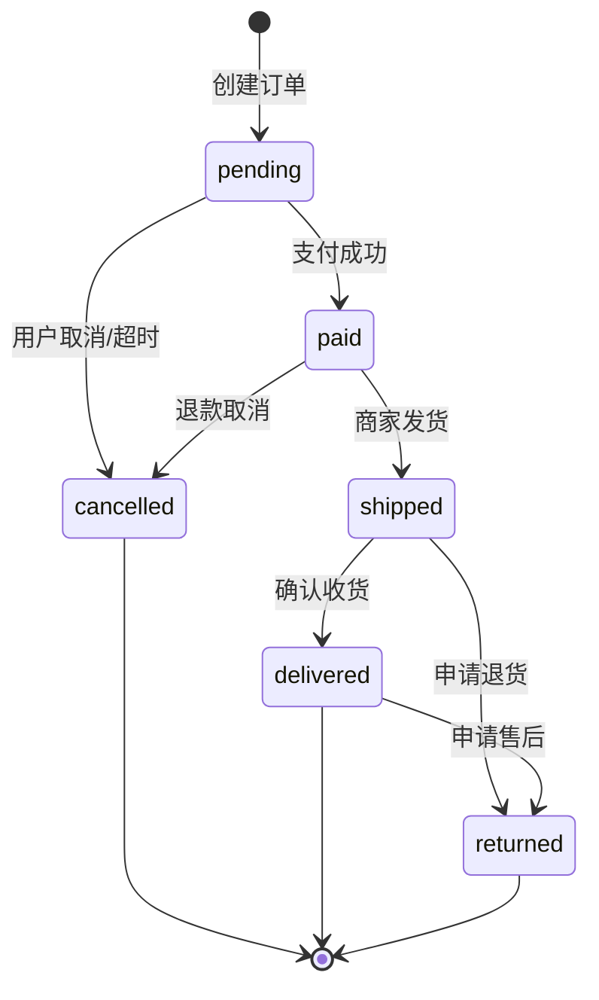

<!--
文档说明：
- 内容：订单管理模块的技术设计文档，包括数据模型、API接口、业务流程设计
- 使用方法：开发订单模块时的技术指导文档，架构设计的具体实现
- 更新方法：技术设计变更时更新，需要架构师确认
- 引用关系：被implementation.md引用，引用requirements.md和架构文档
- 更新频率：设计调整时
-->

# 订单管理模块技术设计

📝 **状态**: 🔄 设计中  
📅 **创建日期**: 2025-01-27  
👤 **负责人**: 技术架构师  
🔄 **最后更新**: 2025-01-27  
📋 **版本**: v1.0.0  

## 设计概述

### 技术栈选择
- **后端框架**: FastAPI + Python 3.11
- **数据库**: MySQL 8.0 (主数据库)
- **缓存**: Redis 7.0 (会话、购物车缓存)
- **ORM**: SQLAlchemy + Alembic
- **认证**: JWT Token
- **API文档**: OpenAPI 3.0

### 模块架构
```
app/modules/order_management/
├── models.py          # 数据模型定义
├── schemas.py         # API请求响应模型
├── service.py         # 业务逻辑层
├── router.py          # API路由层
├── dependencies.py    # 依赖注入
└── __init__.py        # 模块初始化
```

## 数据模型设计

### 核心数据实体

#### 1. 订单主表 (orders)
```python
from sqlalchemy import Column, Integer, String, DECIMAL, Text, DateTime, func, ForeignKey
from sqlalchemy.orm import relationship
## 数据模型设计

### 依赖导入
```python
from sqlalchemy import Column, Integer, String, Text, Numeric, DateTime, ForeignKey
from sqlalchemy.sql import func
from sqlalchemy.orm import relationship
from app.core.database import Base
```

### 数据表结构

#### 1. 订单主表 (orders)
```python

class Order(Base):
    __tablename__ = 'orders'
    
    id = Column(Integer, primary_key=True, autoincrement=True)
    order_number = Column(String(32), unique=True, nullable=False, index=True)
    user_id = Column(Integer, ForeignKey('users.id'), nullable=False, index=True)
    
    # 订单状态
    status = Column(String(20), nullable=False, default='pending')
    
    # 金额信息
    subtotal = Column(Numeric(10, 2), nullable=False, default=0.00)
    shipping_fee = Column(Numeric(10, 2), nullable=False, default=0.00)
    discount_amount = Column(Numeric(10, 2), nullable=False, default=0.00)
    total_amount = Column(Numeric(10, 2), nullable=False, default=0.00)
    
    # 收货信息
    shipping_address = Column(Text, nullable=True)
    shipping_method = Column(String(50), default='standard')
    
    # 备注
    notes = Column(Text, nullable=True)
    remark = Column(Text, nullable=True)  # 内部备注
    
    # 时间节点
    paid_at = Column(DateTime, nullable=True)
    shipped_at = Column(DateTime, nullable=True)
    delivered_at = Column(DateTime, nullable=True)
    
    # 审计字段
    created_at = Column(DateTime, default=func.now(), nullable=False)
    updated_at = Column(DateTime, default=func.now(), onupdate=func.now(), nullable=False)
    
    # 关系映射
    user = relationship("User", back_populates="orders")
    order_items = relationship("OrderItem", back_populates="order", cascade="all, delete-orphan")
```

#### 2. 订单商品表 (order_items)
```python
class OrderItem(Base):
    __tablename__ = 'order_items'
    
    id = Column(Integer, primary_key=True, autoincrement=True)
    order_id = Column(Integer, ForeignKey('orders.id'), nullable=False, index=True)
    product_id = Column(Integer, ForeignKey('products.id'), nullable=False, index=True)
    sku_id = Column(Integer, ForeignKey('skus.id'), nullable=False, index=True)
    
    # 商品快照信息
    sku_code = Column(String(100), nullable=False)
    product_name = Column(String(200), nullable=False)
    sku_name = Column(String(200), nullable=False)
    
    # 数量和价格
    quantity = Column(Integer, nullable=False)
    unit_price = Column(Numeric(10, 2), nullable=False)
    total_price = Column(Numeric(10, 2), nullable=False)
    
    # 审计字段
    created_at = Column(DateTime, default=func.now(), nullable=False)
    
    # 关系映射
    order = relationship("Order", back_populates="order_items")
```

#### 3. 订单状态历史表 (order_status_history)
```python
class OrderStatusHistory(Base):
    __tablename__ = 'order_status_history'
    
    id = Column(Integer, primary_key=True, autoincrement=True)
    order_id = Column(Integer, ForeignKey('orders.id'), nullable=False, index=True)
    old_status = Column(String(20), nullable=True)
    new_status = Column(String(20), nullable=False)
    remark = Column(Text, nullable=True)
    operator_id = Column(Integer, ForeignKey('users.id'), nullable=True)
    created_at = Column(DateTime, default=func.now(), nullable=False)
    
    # 关系映射
    order = relationship("Order")
    operator = relationship("User")
```

### 数据库索引设计
```sql
-- 订单表索引
CREATE INDEX idx_orders_user_status ON orders(user_id, status);
CREATE INDEX idx_orders_status_created ON orders(status, created_at);
CREATE INDEX idx_orders_number ON orders(order_number);

-- 订单商品表索引
CREATE INDEX idx_order_items_order ON order_items(order_id);
CREATE INDEX idx_order_items_product ON order_items(product_id);
CREATE INDEX idx_order_items_sku ON order_items(sku_id);

-- 状态历史表索引
CREATE INDEX idx_status_history_order ON order_status_history(order_id, created_at);
```

## API接口设计

### 接口规范
遵循RESTful设计原则和OpenAPI 3.0标准

#### 1. 订单创建
```http
POST /orders
Content-Type: application/json
Authorization: Bearer <token>

{
  "items": [
    {
      "product_id": 123,
      "sku_id": 456,
      "quantity": 2
    }
  ],
  "shipping_address": {
    "recipient": "张三",
    "phone": "13800138000",
    "address": "北京市朝阳区xxx"
  },
  "notes": "请小心轻放"
}
```

**响应格式**:
```json
{
  "success": true,
  "code": 201,
  "message": "订单创建成功",
  "data": {
    "id": 789,
    "order_number": "ORD20250127100001",
    "status": "pending",
    "total_amount": 199.98,
    "items": [...],
    "created_at": "2025-01-27T10:00:00Z"
  },
  "metadata": {
    "request_id": "req_123456",
    "timestamp": "2025-01-27T10:00:00Z"
  }
}
```

#### 2. 订单列表查询
```http
GET /orders?status=pending&page=1&size=20
Authorization: Bearer <token>
```

#### 3. 订单详情查询
```http
GET /orders/{order_id}
Authorization: Bearer <token>
```

#### 4. 订单状态更新
```http
PATCH /orders/{order_id}/status
Content-Type: application/json
Authorization: Bearer <admin_token>

{
  "status": "shipped",
  "remark": "已通过顺丰快递发货"
}
```

#### 5. 订单取消
```http
DELETE /orders/{order_id}
Authorization: Bearer <token>
```

### 权限控制设计
| 接口 | 普通用户 | 管理员 | 说明 |
|------|---------|--------|------|
| 创建订单 | ✅ (仅自己) | ✅ (任意用户) | 用户只能为自己下单 |
| 查询订单 | ✅ (仅自己) | ✅ (所有订单) | 数据隔离 |
| 更新状态 | ❌ | ✅ | 仅管理员可操作 |
| 取消订单 | ✅ (仅自己) | ✅ (任意订单) | 用户可取消自己的订单 |

## 业务流程设计

### 订单创建流程


### 订单状态流转


### 库存管理集成
```python
# 库存扣减逻辑
async def create_order_with_inventory(order_data, db: Session):
    # 开始数据库事务
    with db.begin():
        # 1. 验证库存
        for item in order_data.items:
            inventory = inventory_service.check_stock(item.sku_id, item.quantity)
            if not inventory.sufficient:
                raise InsufficientStockError(f"SKU {item.sku_id} 库存不足")
        
        # 2. 创建订单
        order = Order(**order_data.dict())
        db.add(order)
        db.flush()  # 获取订单ID
        
        # 3. 创建订单项并扣减库存
        for item in order_data.items:
            # 创建订单项
            order_item = OrderItem(
                order_id=order.id,
                **item.dict()
            )
            db.add(order_item)
            
            # 扣减库存
            inventory_service.reduce_stock(item.sku_id, item.quantity)
        
        # 4. 提交事务
        db.commit()
        
    return order
```

## 错误处理设计

### 错误类型定义
```python
class OrderError(Exception):
    """订单相关错误基类"""
    pass

class InsufficientStockError(OrderError):
    """库存不足错误"""
    pass

class InvalidOrderStatusError(OrderError):
    """无效订单状态错误"""
    pass

class OrderNotFoundError(OrderError):
    """订单不存在错误"""
    pass

class PermissionDeniedError(OrderError):
    """权限不足错误"""
    pass
```

### 错误响应格式
```json
{
  "success": false,
  "code": 400,
  "message": "库存不足",
  "error": {
    "type": "INSUFFICIENT_STOCK",
    "details": [
      {
        "sku_id": 456,
        "requested": 5,
        "available": 2
      }
    ]
  },
  "metadata": {
    "request_id": "req_123456",
    "timestamp": "2025-01-27T10:00:00Z"
  }
}
```

## 性能优化设计

### 缓存策略
```python
# Redis缓存配置
CACHE_CONFIG = {
    "order_details": {
        "ttl": 300,  # 5分钟
        "key_pattern": "order:detail:{order_id}"
    },
    "user_orders": {
        "ttl": 60,   # 1分钟
        "key_pattern": "user:orders:{user_id}:{page}"
    }
}
```

### 数据库优化
1. **连接池配置**: 最大连接数50，最小连接数10
2. **查询优化**: 使用合适的索引，避免全表扫描
3. **批量操作**: 订单项批量插入，减少数据库交互
4. **分页查询**: 使用LIMIT/OFFSET进行分页

### 并发控制
```python
# 使用Redis分布式锁防止重复下单
async def create_order_with_lock(user_id: int, order_data: OrderCreateRequest):
    lock_key = f"order:create:{user_id}"
    
    async with redis_client.lock(lock_key, timeout=30):
        # 检查是否有重复订单
        existing = await check_duplicate_order(user_id, order_data)
        if existing:
            raise DuplicateOrderError("订单已存在")
        
        # 创建订单
        return await create_order(order_data)
```

## 安全设计

### 权限验证
```python
# 订单所有权验证
def verify_order_ownership(order_id: int, current_user: User):
    if current_user.role in ['admin', 'super_admin']:
        return True
    
    order = get_order_by_id(order_id)
    if not order:
        raise OrderNotFoundError("订单不存在")
    
    if order.user_id != current_user.id:
        raise PermissionDeniedError("无权访问此订单")
    
    return True
```

### 数据验证
```python
# 输入数据验证
class OrderCreateRequest(BaseModel):
    items: List[OrderItemRequest] = Field(..., min_items=1, max_items=50)
    shipping_address: ShippingAddressRequest
    notes: Optional[str] = Field(None, max_length=500)
    
    @validator('items')
    def validate_items(cls, v):
        # 验证商品项不重复
        sku_ids = [item.sku_id for item in v]
        if len(sku_ids) != len(set(sku_ids)):
            raise ValueError('订单不能包含重复的SKU')
        return v
```

## 监控和日志

### 关键指标监控
- 订单创建成功率
- 平均订单处理时间
- 库存扣减准确率
- API响应时间

### 日志记录
```python
# 结构化日志
import structlog

logger = structlog.get_logger()

# 订单操作日志
logger.info(
    "order_created",
    order_id=order.id,
    user_id=order.user_id,
    total_amount=order.total_amount,
    items_count=len(order.items)
)

# 状态变更日志
logger.info(
    "order_status_changed",
    order_id=order.id,
    old_status=old_status,
    new_status=new_status,
    operator_id=current_user.id
)
```

## 扩展性考虑

### 模块扩展点
1. **支付集成**: 预留支付回调接口
2. **物流集成**: 预留发货通知接口
3. **营销活动**: 预留优惠券应用接口
4. **批次溯源**: 预留农产品溯源集成

### 配置化设计
```python
# 订单配置
ORDER_CONFIG = {
    "auto_cancel_minutes": 30,        # 自动取消时间
    "max_items_per_order": 50,        # 单订单最大商品数
    "default_shipping_fee": 0.00,     # 默认运费
    "free_shipping_threshold": 99.00, # 免运费门槛
}
```

---

## 版本历史

| 版本 | 日期 | 变更说明 | 负责人 |
|------|------|----------|--------|
| v1.0.0 | 2025-01-27 | 初版技术设计，定义核心数据模型和API | 技术架构师 |

## 相关文档

- [订单模块需求规范](requirements.md) - 业务需求定义
- [系统架构总览](../../architecture/overview.md) - 整体技术架构
- [API设计标准](../../standards/api-standards.md) - API规范标准
- [数据库设计规范](../../standards/database-standards.md) - 数据库设计标准