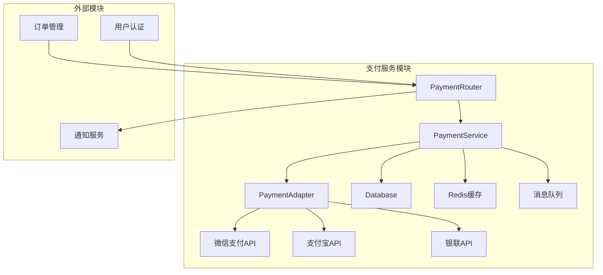
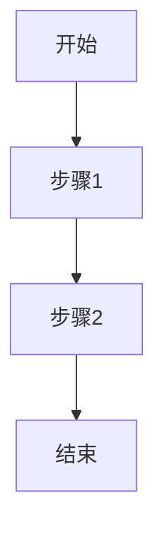

<!--
文档说明：
- 内容：模块文档标准模板，用于创建新的模块文档  
- 使用方法：复制此模板，替换模板变量，填入具体内容
- 更新方法：模板规范变更时由架构师更新
- 引用关系：被所有模块文档使用
- 更新频率：模板标准变化时

⚠️ 强制文档要求：
每个模块必须包含以下7个文档（无可选项）：
1. README.md - 模块导航（简洁版入口）
2. overview.md - 模块概述（本模板，详细版）
3. requirements.md - 业务需求文档（强制）
4. design.md - 设计决策文档（强制）
5. api-spec.md - API规范文档（强制）
6. api-implementation.md - API实施记录（强制）
7. implementation.md - 实现细节文档（强制）
-->

# payment-service支付服务模块

📝 **状态**: ✅ 已发布  
📅 **创建日期**: 2025-09-16  
👤 **负责人**: 开发团队  
🔄 **最后更新**: 2025-09-16  
📋 **版本**: v1.0.0  

## 模块概述

### 主要职责
支付服务模块是电商平台的核心交易组件，提供完整的支付解决方案：
- **支付集成管理**: 统一管理微信支付、支付宝、银联等多种支付渠道
- **支付流程控制**: 处理支付创建、状态跟踪、回调验证等完整支付流程
- **退款服务**: 提供灵活的退款申请、审批、处理机制
- **资金安全保障**: 实施多层安全防护，确保支付数据和资金安全
- **支付数据统计**: 提供支付趋势分析和业务决策数据支持

### 业务价值
- **核心价值**: 为平台提供安全、稳定、高效的支付服务，是交易闭环的关键环节
- **用户收益**: 支持多样化支付方式，提升支付体验，保障资金安全
- **系统收益**: 统一支付接口设计，降低系统耦合度，提高可维护性和可扩展性
- **商业收益**: 支持多渠道支付降低用户流失，完善的退款机制提升用户信任度

### 模块边界
- **包含功能**: 支付单管理、第三方支付集成、退款处理、支付回调、风控检查、支付统计
- **排除功能**: 订单管理、库存扣减、物流发货、用户认证(依赖其他模块)
- **依赖模块**: user-auth(用户认证)、order-management(订单信息)、notification-service(支付通知)
- **被依赖**: 被order-management调用创建支付，被member-system调用处理积分支付

## 技术架构

### 架构图


### 核心组件
```
payment-service/
├── router.py           # API路由定义 - FastAPI路由和参数验证
├── service.py          # 业务逻辑处理 - 支付核心业务逻辑
├── models.py           # 数据模型定义 - Payment和Refund模型
├── schemas.py          # 请求/响应模型 - Pydantic数据验证
├── dependencies.py     # 模块依赖注入 - 认证和权限依赖
├── auth_helpers.py     # 安全辅助模块 - 权限验证和安全检查
└── utils.py            # 工具函数 - 支付号生成、数据处理等
```

### 模块化单体架构
- **架构模式**: 模块化单体架构 (Modular Monolith)，垂直业务切片
- **垂直切片**: 每个模块包含API、业务逻辑、数据模型的完整功能
- **依赖原则**: 通过依赖注入实现模块间解耦，依赖抽象而非实现

### 核心基础设施
```
app/core/               # 核心基础设施
├── database.py         # 数据库连接管理 - SQLAlchemy配置
├── redis_client.py     # Redis缓存客户端 - 支付缓存策略
└── security_logger.py  # 安全日志记录 - 支付操作审计
```

### 适配器集成
```
app/adapters/payment/   # 支付服务适配器
├── base.py            # 支付适配器基类
├── wechat_adapter.py  # 微信支付适配器
├── alipay_adapter.py  # 支付宝适配器
└── config.py          # 支付配置管理
```

### 技术栈
- **编程语言**: Python 3.11+
- **Web框架**: FastAPI + Pydantic数据验证
- **数据库**: PostgreSQL 14+ (事务一致性)
- **缓存**: Redis 6+ (支付状态缓存)
- **其他依赖**: SQLAlchemy ORM, Alembic迁移, cryptography加密

### 设计模式
- **适配器模式**: 统一不同支付渠道的接口差异
- **策略模式**: 支付方式选择和处理策略
- **状态机模式**: 支付和退款状态管理
- **工厂模式**: 支付适配器实例创建
- **分层架构**: API层-业务层-数据层清晰分离

## 核心功能

### 功能列表
| 功能名称 | 优先级 | 状态 | 描述 |
|---------|--------|------|------|
| 功能1 | 高 | ✅ 已完成 | 功能简要描述 |
| 功能2 | 中 | 🔄 开发中 | 功能简要描述 |
| 功能3 | 低 | ⏳ 待开始 | 功能简要描述 |

### 核心业务流程


### 业务规则
1. **规则1**: 详细描述业务规则
2. **规则2**: 详细描述业务规则
3. **规则3**: 详细描述业务规则

## 数据模型

### 核心实体
```python
# 主要数据模型示例
class {EntityName}(Base):
    __tablename__ = "{table_name}"
    
    id = Column(Integer, primary_key=True)
    name = Column(String(100), nullable=False)
    created_at = Column(DateTime, default=datetime.utcnow)
    updated_at = Column(DateTime, default=datetime.utcnow, onupdate=datetime.utcnow)
```

### 数据关系图
```
{实体关系图，可以使用Mermaid ER图}
```

### 数据约束
- **唯一性约束**: 字段级别的唯一性要求
- **外键约束**: 与其他表的关系约束
- **业务约束**: 业务级别的数据约束

## API接口

### 接口列表
| 接口 | 方法 | 路径 | 描述 | 状态 |
|------|------|------|------|------|
| 创建{实体} | POST | /api/v1/{entities} | 创建新的{实体} | ✅ |
| 获取{实体} | GET | /api/v1/{entities}/{id} | 获取指定{实体} | ✅ |
| 更新{实体} | PUT | /api/v1/{entities}/{id} | 更新{实体}信息 | 🔄 |
| 删除{实体} | DELETE | /api/v1/{entities}/{id} | 删除{实体} | ⏳ |

### 接口详情示例
```yaml
/api/v1/{entities}:
  post:
    summary: 创建{实体}
    requestBody:
      required: true
      content:
        application/json:
          schema:
            $ref: '#/components/schemas/{Entity}Create'
    responses:
      201:
        description: 创建成功
        content:
          application/json:
            schema:
              $ref: '#/components/schemas/{Entity}'
      400:
        description: 请求参数错误
```

### 错误码
| 错误码 | 状态码 | 描述 | 解决方案 |
|--------|--------|------|----------|
| {MODULE}_001 | 400 | 参数验证失败 | 检查请求参数 |
| {MODULE}_002 | 404 | 资源不存在 | 确认资源ID |
| {MODULE}_003 | 409 | 资源冲突 | 检查资源状态 |

## 测试策略

### 测试覆盖率目标
- **单元测试**: ≥ 85%
- **集成测试**: ≥ 70%
- **端到端测试**: 核心业务流程100%

### 测试类型
```python
# 单元测试示例
class Test{Entity}Service:
    def test_create_{entity}_success(self):
        # 测试成功创建{实体}
        pass
    
    def test_create_{entity}_validation_error(self):
        # 测试验证错误
        pass

# 集成测试示例  
class Test{Entity}API:
    def test_{entity}_crud_workflow(self):
        # 测试完整CRUD流程
        pass
```

### 性能测试
- **响应时间**: API响应时间 < 500ms
- **并发处理**: 支持100并发请求
- **数据量**: 支持100万条记录

### 测试数据
- **测试数据生成**: Factory Boy或自定义工厂
- **数据清理**: 每个测试后清理测试数据
- **Mock策略**: 外部依赖的Mock策略

## 部署和运维

### 环境要求
- **开发环境**: 本地开发环境配置
- **测试环境**: 测试环境配置要求
- **生产环境**: 生产环境配置要求

### 配置管理
```python
# 环境变量配置
{MODULE}_DATABASE_URL=mysql://...
{MODULE}_REDIS_URL=redis://...
{MODULE}_LOG_LEVEL=INFO
```

### 监控指标
- **业务指标**: 关键业务指标监控
- **技术指标**: 响应时间、错误率等
- **资源指标**: CPU、内存、数据库连接等

### 告警规则
- **错误率**: > 1% 触发告警
- **响应时间**: > 1s 触发告警
- **资源使用**: > 80% 触发告警

## 安全考虑

### 认证授权
- **身份认证**: JWT Token验证
- **权限控制**: 基于角色的访问控制
- **API安全**: Rate Limiting、CORS等

### 数据安全
- **数据加密**: 敏感数据加密存储
- **传输安全**: HTTPS传输
- **输入验证**: 严格的输入验证

### 审计日志
- **操作日志**: 记录关键操作
- **访问日志**: 记录API访问
- **安全日志**: 记录安全相关事件

## 性能优化

### 缓存策略
- **应用缓存**: Redis缓存热点数据
- **数据库缓存**: 查询结果缓存
- **CDN缓存**: 静态资源缓存

### 数据库优化
- **索引优化**: 关键字段索引
- **查询优化**: SQL查询优化
- **连接池**: 数据库连接池配置

### 扩展性设计
- **水平扩展**: 支持多实例部署
- **垂直扩展**: 资源配置优化
- **降级策略**: 服务降级机制

## 问题和风险

### 已知问题
| 问题ID | 描述 | 优先级 | 状态 | 解决方案 |
|--------|------|--------|------|----------|
| {MODULE}-001 | 问题描述 | 高 | 🔄 处理中 | 解决方案 |

### 技术风险
- **风险1**: 风险描述和缓解措施
- **风险2**: 风险描述和缓解措施

### 技术债务
- **债务1**: 技术债务描述和还债计划
- **债务2**: 技术债务描述和还债计划

## 开发计划

### 里程碑
- **M1**: 基础功能开发 (预计: {日期})
- **M2**: 完整功能实现 (预计: {日期})
- **M3**: 性能优化 (预计: {日期})

### 任务分解
- [ ] 任务1 (负责人: {姓名}, 预计: {日期})
- [ ] 任务2 (负责人: {姓名}, 预计: {日期})
- [ ] 任务3 (负责人: {姓名}, 预计: {日期})

## 相关文档

### 架构文档
- [系统架构总览](../architecture/overview.md)
- [API设计规范](../architecture/api-standards.md)
- [数据模型规范](../architecture/data-models.md)

### 开发文档
- [开发规范](../development/development-standards.md)
- [测试指南](../development/testing.md)
- [部署指南](../operations/deployment.md)

### 需求文档
- [业务需求](../requirements/business.md)
- [功能需求](../requirements/functional.md)

### 其他模块
- [依赖模块1](../modules/{module1}/overview.md)
- [依赖模块2](../modules/{module2}/overview.md)

---

📝 **模板使用说明**:
1. 复制此模板创建新的模块文档
2. 替换所有 `{变量}` 为实际值
3. 删除不适用的章节
4. 根据模块特点调整章节内容
5. 保持文档及时更新

