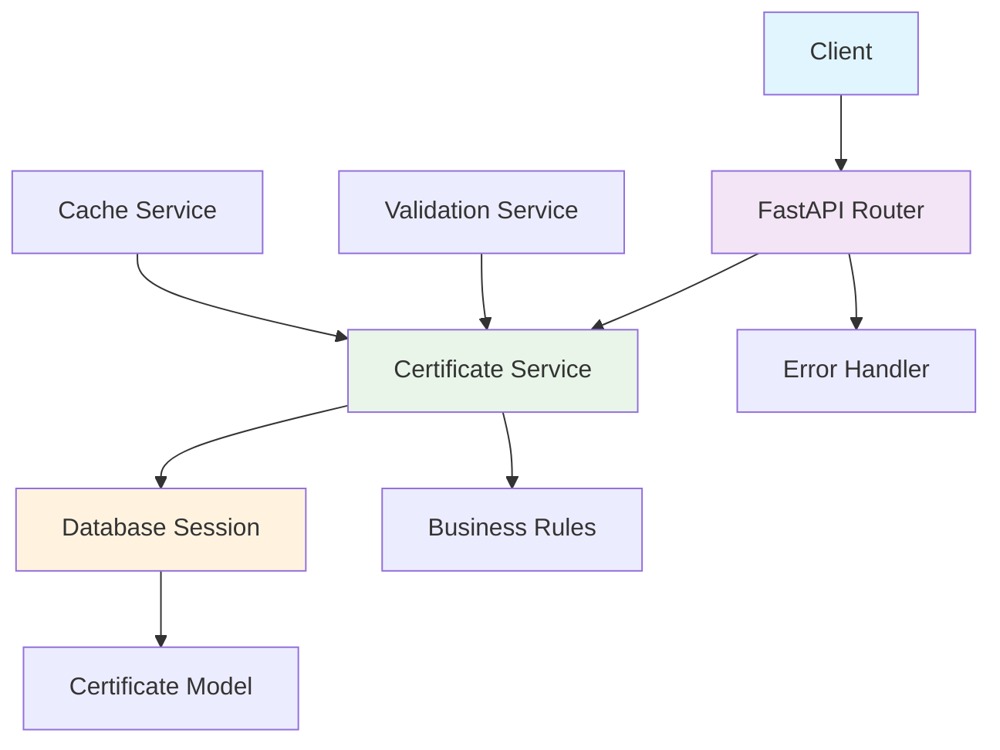

# 质量控制模块 技术设计

## 设计概述

质量控制模块采用简洁的三层架构设计，专注于农产品质量认证证书的管理。设计遵循单一职责原则，确保模块功能边界清晰。

## 技术选型

### 核心技术栈
- **Web框架**: FastAPI 0.100.0+ - 高性能API框架
- **ORM框架**: SQLAlchemy 2.0+ - 数据库操作抽象层
- **数据验证**: Pydantic 2.0+ - 数据模型和验证
- **数据库**: PostgreSQL/MySQL - 关系型数据库
- **缓存**: Redis - 高性能缓存（未来扩展）

### 架构模式
- **模块化单体架构** - 独立的业务模块
- **RESTful API设计** - 标准的HTTP API接口
- **依赖注入模式** - 松耦合的组件设计
- **数据传输对象模式** - 清晰的请求/响应模型

## 模块架构设计

### 架构分层
```
┌─────────────────────────────────────────────────────┐
│                  API Layer (路由层)                  │
│  ┌─────────────────────────────────────────────────┐ │
│  │ router.py - FastAPI路由定义和请求处理            │ │
│  │ schemas.py - 请求/响应数据模型（待实现）         │ │
│  └─────────────────────────────────────────────────┘ │
├─────────────────────────────────────────────────────┤
│                Service Layer (业务层)               │
│  ┌─────────────────────────────────────────────────┐ │
│  │ service.py - 业务逻辑处理（待实现）              │ │
│  │ validation.py - 业务规则验证（待实现）           │ │
│  └─────────────────────────────────────────────────┘ │
├─────────────────────────────────────────────────────┤
│                 Data Layer (数据层)                 │
│  ┌─────────────────────────────────────────────────┐ │
│  │ models.py - 本地数据模型（当前为空）             │ │
│  │ app.shared.models.Certificate - 共享数据模型     │ │
│  └─────────────────────────────────────────────────┘ │
├─────────────────────────────────────────────────────┤
│               Dependency Layer (依赖层)             │
│  ┌─────────────────────────────────────────────────┐ │
│  │ dependencies.py - 依赖注入配置                   │ │
│  │ app.core.database - 数据库连接管理               │ │
│  └─────────────────────────────────────────────────┘ │
└─────────────────────────────────────────────────────┘
```

### 组件交互图


## 数据模型设计

### Certificate 模型分析
```python
class Certificate(Base):
    """质量认证证书模型"""
    __tablename__ = 'certificates'
    
    # 主键
    id = Column(BigInteger, primary_key=True, index=True)
    
    # 证书基本信息
    name = Column(String(200), nullable=False, comment="证书名称")
    issuer = Column(String(200), nullable=True, comment="发证机构")
    serial = Column(String(200), unique=True, nullable=False, comment="证书序列号")
    
    # 当前缺失但建议添加的字段
    # description = Column(Text, nullable=True, comment="证书描述")
    # certificate_type = Column(String(50), nullable=True, comment="证书类型")
    # issue_date = Column(Date, nullable=True, comment="发证日期")
    # expire_date = Column(Date, nullable=True, comment="过期日期")
    # file_url = Column(String(500), nullable=True, comment="证书文件URL")
    # verification_url = Column(String(500), nullable=True, comment="验证查询URL")
    # status = Column(String(20), default='active', comment="证书状态")
    # created_at = Column(DateTime, default=func.now(), comment="创建时间")
    # updated_at = Column(DateTime, default=func.now(), onupdate=func.now(), comment="更新时间")
```

### 数据库索引设计
```sql
-- 主键索引（自动创建）
CREATE INDEX idx_certificates_id ON certificates(id);

-- 唯一索引：证书序列号
CREATE UNIQUE INDEX idx_certificates_serial ON certificates(serial);

-- 查询索引：发证机构
CREATE INDEX idx_certificates_issuer ON certificates(issuer);

-- 全文索引：证书名称（用于搜索）
CREATE INDEX idx_certificates_name ON certificates(name);

-- 复合索引：类型+状态（未来扩展）
-- CREATE INDEX idx_certificates_type_status ON certificates(certificate_type, status);
```

## API设计详解

### RESTful API遵循原则
1. **资源导向**: 以certificates为核心资源
2. **HTTP方法语义**: GET查询、POST创建、DELETE删除
3. **状态码标准**: 200成功、201创建、404未找到、400请求错误
4. **统一响应格式**: JSON格式，错误信息标准化

### 路由设计模式
```python
# 路由前缀模式
router = APIRouter()  # 模块内部路由器

# 在主应用中注册，使用业务概念层命名
app.include_router(
    router, 
    prefix="/api/v1/quality-control",  # 业务概念层：连字符
    tags=["质量控制"]
)

# 路由定义模式
@router.post("/certificates", response_model=CertificateRead)  # 资源复数形式
@router.get("/certificates", response_model=List[CertificateRead])
@router.get("/certificates/{cert_id}", response_model=CertificateRead)
@router.delete("/certificates/{cert_id}")
```

### 数据传输对象设计
```python
# 请求模型（待实现）
class CertificateCreate(BaseModel):
    name: str = Field(..., max_length=200, description="证书名称")
    issuer: Optional[str] = Field(None, max_length=200, description="发证机构")
    serial: str = Field(..., max_length=200, description="证书序列号")
    description: Optional[str] = Field(None, description="证书描述")

# 响应模型（待实现）
class CertificateRead(BaseModel):
    id: int
    name: str
    issuer: Optional[str]
    serial: str
    description: Optional[str]
    
    class Config:
        from_attributes = True  # Pydantic v2语法
```

## 业务逻辑设计

### 证书管理业务流程
```python
class CertificateService:
    """证书管理业务服务"""
    
    async def create_certificate(self, cert_data: CertificateCreate) -> Certificate:
        """创建证书业务逻辑"""
        # 1. 验证序列号唯一性
        if await self.check_serial_exists(cert_data.serial):
            raise ValueError("证书序列号已存在")
        
        # 2. 创建证书记录
        certificate = Certificate(**cert_data.dict())
        
        # 3. 保存到数据库
        return await self.repository.save(certificate)
    
    async def get_certificate_by_id(self, cert_id: int) -> Optional[Certificate]:
        """根据ID获取证书"""
        return await self.repository.get_by_id(cert_id)
    
    async def list_certificates(self, skip: int, limit: int) -> List[Certificate]:
        """分页获取证书列表"""
        return await self.repository.get_list(skip=skip, limit=limit)
    
    async def delete_certificate(self, cert_id: int) -> bool:
        """删除证书"""
        # 1. 检查证书是否存在
        certificate = await self.get_certificate_by_id(cert_id)
        if not certificate:
            raise ValueError("证书不存在")
        
        # 2. 检查是否被其他模块引用（未来功能）
        # if await self.check_certificate_references(cert_id):
        #     raise ValueError("证书正在被使用，无法删除")
        
        # 3. 执行删除
        return await self.repository.delete(cert_id)
```

### 错误处理策略
```python
# 自定义异常类
class CertificateError(Exception):
    """证书相关错误基类"""
    pass

class CertificateNotFoundError(CertificateError):
    """证书不存在错误"""
    pass

class DuplicateSerialError(CertificateError):
    """重复序列号错误"""
    pass

# 错误处理装饰器
@router.exception_handler(CertificateError)
async def certificate_exception_handler(request, exc):
    return JSONResponse(
        status_code=400,
        content={"detail": str(exc)}
    )
```

## 性能优化设计

### 查询优化策略
1. **数据库索引**: 在常用查询字段建立索引
2. **分页查询**: 避免一次性加载大量数据
3. **连接池**: 使用SQLAlchemy连接池管理数据库连接
4. **查询缓存**: 对热门证书信息进行缓存（未来功能）

### 缓存设计（未来扩展）
```python
class CertificateCacheService:
    """证书缓存服务"""
    
    async def get_cached_certificate(self, cert_id: int) -> Optional[Certificate]:
        """从缓存获取证书"""
        cache_key = f"certificate:{cert_id}"
        cached_data = await self.redis.get(cache_key)
        if cached_data:
            return Certificate.parse_raw(cached_data)
        return None
    
    async def cache_certificate(self, certificate: Certificate, ttl: int = 3600):
        """缓存证书信息"""
        cache_key = f"certificate:{certificate.id}"
        await self.redis.setex(
            cache_key, 
            ttl, 
            certificate.json()
        )
```

## 安全设计

### 输入验证
1. **参数验证**: 使用Pydantic模型验证所有输入参数
2. **长度限制**: 对字符串字段设置合理的长度限制
3. **SQL注入防护**: 使用ORM参数化查询，避免SQL注入
4. **XSS防护**: 对输出内容进行适当转义

### 权限控制
```python
# 权限依赖注入（未来功能）
async def get_admin_user(current_user: User = Depends(get_current_user)):
    """管理员权限检查"""
    if not current_user.is_admin:
        raise HTTPException(status_code=403, detail="权限不足")
    return current_user

# 在路由中使用权限控制
@router.post("/certificates", dependencies=[Depends(get_admin_user)])
async def create_certificate(cert_data: CertificateCreate):
    """创建证书（需要管理员权限）"""
    pass
```

## 测试设计

### 单元测试策略
```python
class TestCertificateService:
    """证书服务单元测试"""
    
    async def test_create_certificate_success(self):
        """测试成功创建证书"""
        # 准备测试数据
        cert_data = CertificateCreate(
            name="测试证书",
            issuer="测试机构",
            serial="TEST-001"
        )
        
        # 执行测试
        result = await self.service.create_certificate(cert_data)
        
        # 验证结果
        assert result.name == "测试证书"
        assert result.serial == "TEST-001"
    
    async def test_create_certificate_duplicate_serial(self):
        """测试重复序列号错误"""
        # 测试重复序列号的错误处理
        with pytest.raises(DuplicateSerialError):
            await self.service.create_certificate(duplicate_cert_data)
```

### 集成测试策略
```python
class TestCertificateAPI:
    """证书API集成测试"""
    
    async def test_certificate_crud_flow(self):
        """测试完整的CRUD流程"""
        # 1. 创建证书
        create_response = await self.client.post("/api/v1/quality-control/certificates", json={...})
        assert create_response.status_code == 201
        
        # 2. 获取证书
        cert_id = create_response.json()["id"]
        get_response = await self.client.get(f"/api/v1/quality-control/certificates/{cert_id}")
        assert get_response.status_code == 200
        
        # 3. 删除证书
        delete_response = await self.client.delete(f"/api/v1/quality-control/certificates/{cert_id}")
        assert delete_response.status_code == 204
```

## 部署考虑

### 环境配置
```python
# 配置管理
class QualityControlSettings(BaseSettings):
    certificate_max_file_size: int = 10 * 1024 * 1024  # 10MB
    certificate_allowed_formats: List[str] = ["pdf", "jpg", "png"]
    cache_ttl: int = 3600  # 1小时
    
    class Config:
        env_prefix = "QUALITY_CONTROL_"
```

### 监控指标
1. **API响应时间**: 监控各个端点的响应时间
2. **错误率**: 监控API调用的错误率
3. **数据库连接**: 监控数据库连接池状态
4. **缓存命中率**: 监控缓存的命中率（未来功能）

## 未来扩展计划

### 功能扩展
1. **证书文件上传**: 支持证书图片/PDF文件上传
2. **证书验证**: 对接第三方机构API验证证书真实性
3. **证书关联**: 与商品、批次建立关联关系
4. **证书搜索**: 支持全文搜索和高级过滤
5. **证书审核**: 支持证书的审核工作流

### 技术升级
1. **异步处理**: 使用消息队列处理耗时操作
2. **文件存储**: 集成OSS/S3对象存储服务
3. **微服务拆分**: 当业务复杂度增加时考虑拆分为独立服务
4. **GraphQL支持**: 提供更灵活的数据查询接口

## 总结

质量控制模块采用简洁实用的设计，专注于核心的证书管理功能。设计充分考虑了可扩展性和可维护性，为未来功能扩展留下了充足的空间。当前的实现满足了MVP阶段的需求，同时为后续的迭代开发奠定了良好的基础。