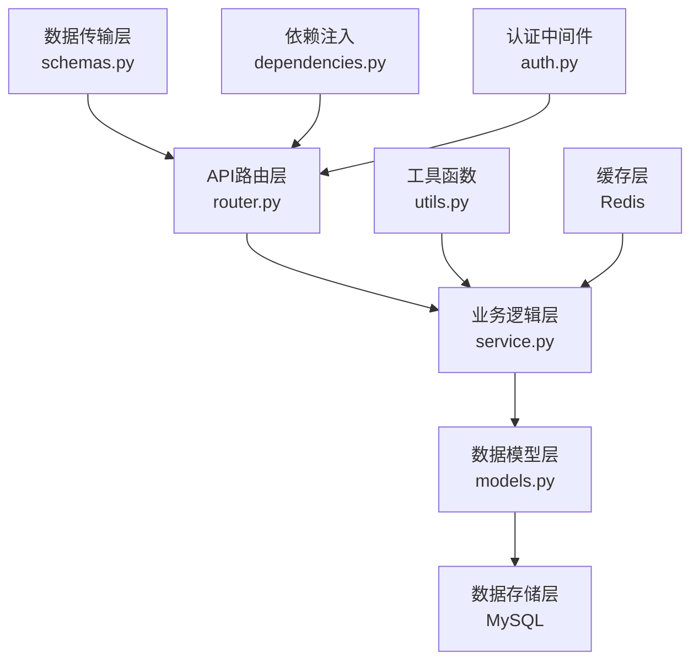
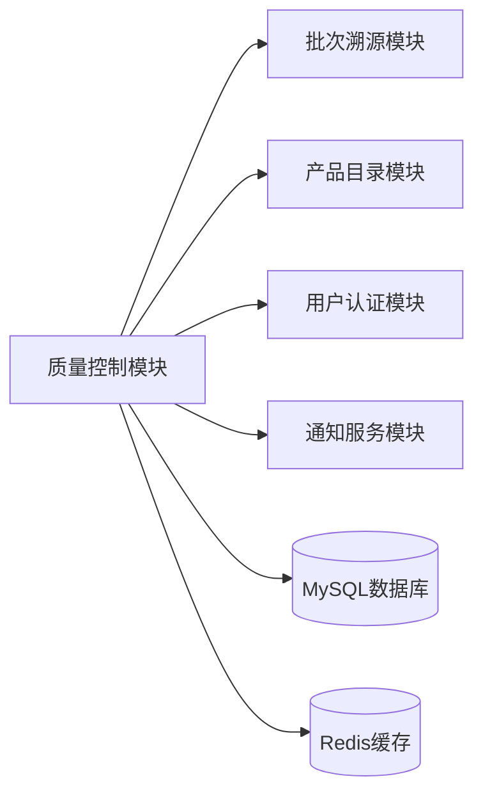
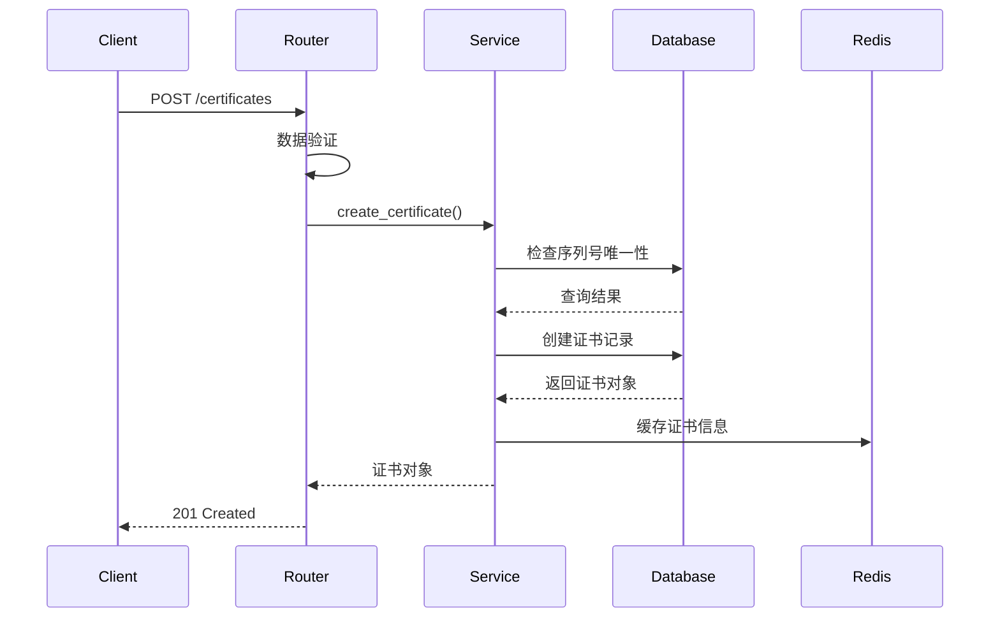
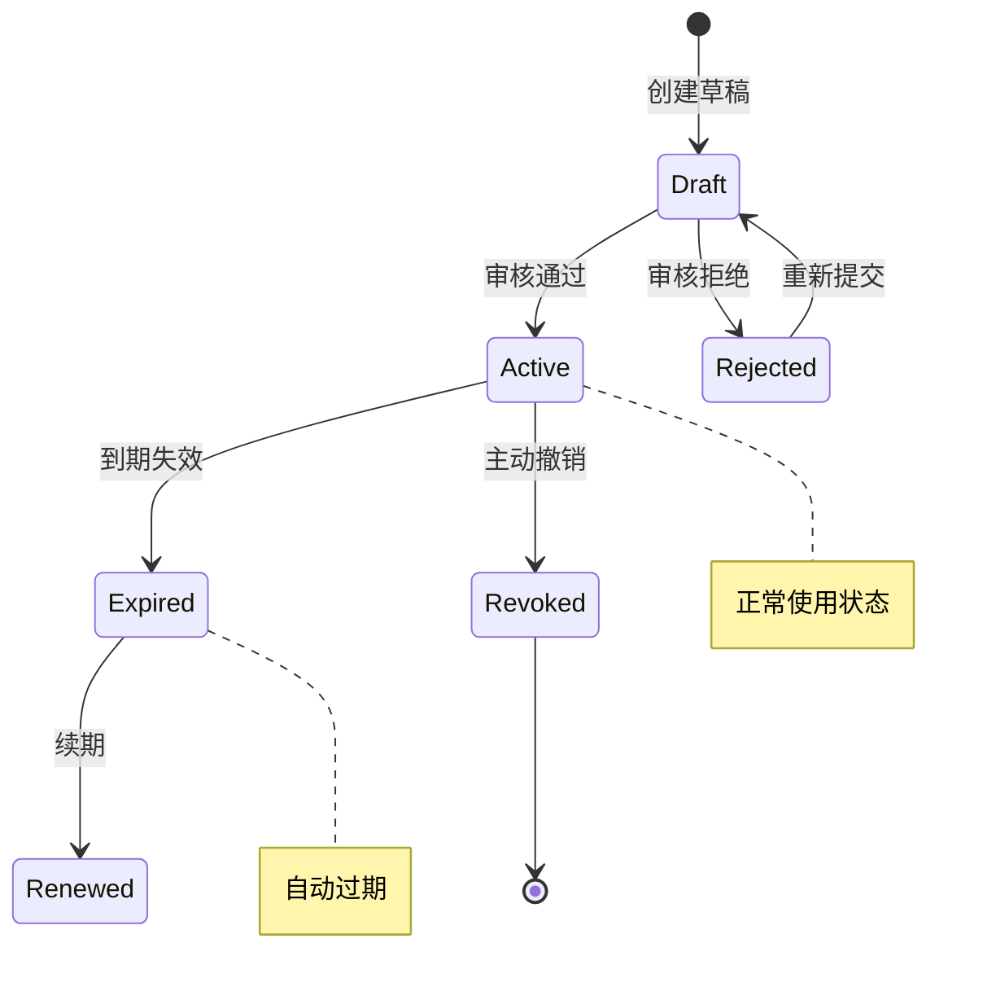

# 质量控制模块技术设计文档

## 文档信息
- **模块名称**: 质量控制模块 (Quality Control Module)
- **版本**: v1.0.0
- **创建时间**: 2024-01-20
- **设计师**: 系统架构师
- **审核状态**: 已完成  
👤 **设计者**: {技术负责人}  
## 设计概述

### 设计目标
- **高可靠性**: 确保证书数据的完整性和一致性，防止数据丢失和篡改
- **高性能**: 支持大规模证书查询和管理，响应时间满足业务要求
- **可扩展性**: 设计灵活的架构，支持未来功能扩展和业务增长
- **易维护性**: 代码结构清晰，遵循最佳实践，便于后续维护和开发

### 设计原则
- **单一职责**: 每个类和模块只负责一个明确的业务职责，Certificate模型只负责证书数据管理
- **开放封闭**: 通过接口抽象实现对扩展开放对修改封闭，如质量标准检查引擎可插拔设计
- **依赖倒置**: 业务层依赖抽象接口而非具体实现，通过依赖注入实现解耦

### 关键设计决策
| 决策点 | 选择方案 | 理由 | 替代方案 |
|--------|----------|------|----------|
| 数据库主键类型 | INTEGER自增主键 | 符合项目统一标准，性能优异 | UUID主键 |
| API架构风格 | RESTful API | 简单易懂，与项目整体风格一致 | GraphQL |
| 数据验证方式 | Pydantic模型验证 | 类型安全，与FastAPI深度集成 | 手动验证 |
| 缓存策略 | Redis查询缓存 | 提高查询性能，减少数据库压力 | 无缓存 |
| 日志记录 | 结构化JSON日志 | 便于日志分析和监控 | 文本日志 |

## 系统架构设计

### 整体架构


### 模块内部架构
```
app/modules/quality_control/
├── __init__.py         # 模块导出
├── router.py           # API路由层 - FastAPI路由定义
├── service.py          # 业务逻辑层 - 核心业务逻辑处理
├── models.py           # 数据模型层 - SQLAlchemy ORM模型
├── schemas.py          # 数据传输对象 - Pydantic模型
├── dependencies.py     # 依赖注入 - FastAPI依赖配置
└── utils.py            # 工具函数 - 辅助功能函数
```

### 层次职责
- **API层 (router.py)**: 
  - HTTP请求路由和响应处理
  - 请求参数验证和响应格式化
  - 认证授权集成
  - 错误处理和异常捕获
  
- **业务层 (service.py)**: 
  - 核心业务逻辑实现
  - 业务规则验证和处理
  - 外部服务集成调用
  - 事务管理和数据一致性保证
  
- **数据层 (models.py)**: 
  - 数据模型定义和关系映射
  - 数据库操作封装
  - 数据完整性约束
  - 查询优化和索引管理

### 模块间集成设计


## 数据库设计

### 表结构设计
```sql
-- 证书表 (certificates)
CREATE TABLE certificates (
    id INT PRIMARY KEY AUTO_INCREMENT COMMENT '证书ID',
    serial VARCHAR(100) NOT NULL UNIQUE COMMENT '证书序列号',
    name VARCHAR(255) NOT NULL COMMENT '证书名称',
    issuer VARCHAR(255) NOT NULL COMMENT '颁发机构',
    description TEXT COMMENT '证书描述',
    issued_at DATETIME NOT NULL COMMENT '颁发时间',
    expires_at DATETIME NOT NULL COMMENT '过期时间',
    is_active BOOLEAN DEFAULT TRUE NOT NULL COMMENT '是否有效',
    created_at DATETIME DEFAULT CURRENT_TIMESTAMP COMMENT '创建时间',
    updated_at DATETIME DEFAULT CURRENT_TIMESTAMP ON UPDATE CURRENT_TIMESTAMP COMMENT '更新时间',
    
    INDEX idx_serial (serial),
    INDEX idx_issuer (issuer),
    INDEX idx_expires_at (expires_at),
    INDEX idx_is_active (is_active),
    INDEX idx_created_at (created_at)
) ENGINE=InnoDB DEFAULT CHARSET=utf8mb4 COMMENT='质量控制证书表';

-- 质量标准表 (quality_standards) - 预留设计
CREATE TABLE quality_standards (
    id INT PRIMARY KEY AUTO_INCREMENT COMMENT '标准ID',
    code VARCHAR(50) NOT NULL UNIQUE COMMENT '标准编号',
    name VARCHAR(255) NOT NULL COMMENT '标准名称',
    category VARCHAR(100) NOT NULL COMMENT '标准类别',
    version VARCHAR(20) NOT NULL COMMENT '标准版本',
    description TEXT COMMENT '标准描述',
    is_active BOOLEAN DEFAULT TRUE NOT NULL COMMENT '是否有效',
    created_at DATETIME DEFAULT CURRENT_TIMESTAMP,
    updated_at DATETIME DEFAULT CURRENT_TIMESTAMP ON UPDATE CURRENT_TIMESTAMP,
    
    INDEX idx_code (code),
    INDEX idx_category (category),
    INDEX idx_is_active (is_active)
) ENGINE=InnoDB DEFAULT CHARSET=utf8mb4 COMMENT='质量标准表';

-- 合规检查记录表 (compliance_checks) - 预留设计
CREATE TABLE compliance_checks (
    id INT PRIMARY KEY AUTO_INCREMENT COMMENT '检查ID',
    product_id INT NOT NULL COMMENT '产品ID',
    certificate_id INT COMMENT '关联证书ID',
    standard_id INT NOT NULL COMMENT '检查标准ID',
    check_result ENUM('PASS', 'FAIL', 'WARNING') NOT NULL COMMENT '检查结果',
    check_score DECIMAL(5,2) COMMENT '检查得分',
    check_report JSON COMMENT '检查报告详情',
    checked_at DATETIME DEFAULT CURRENT_TIMESTAMP COMMENT '检查时间',
    created_at DATETIME DEFAULT CURRENT_TIMESTAMP,
    
    INDEX idx_product_id (product_id),
    INDEX idx_certificate_id (certificate_id),
    INDEX idx_check_result (check_result),
    INDEX idx_checked_at (checked_at),
    
    FOREIGN KEY (certificate_id) REFERENCES certificates(id) ON DELETE SET NULL
) ENGINE=InnoDB DEFAULT CHARSET=utf8mb4 COMMENT='合规检查记录表';
```

### 索引设计
| 表名 | 索引名 | 索引字段 | 索引类型 | 用途 |
|------|--------|----------|----------|------|
| certificates | PRIMARY | id | 聚集索引 | 主键查询 |
| certificates | idx_serial | serial | 唯一索引 | 序列号查询 |
| certificates | idx_issuer | issuer | 普通索引 | 按颁发机构筛选 |
| certificates | idx_expires_at | expires_at | 普通索引 | 过期时间查询 |
| certificates | idx_is_active | is_active | 普通索引 | 状态筛选 |
| certificates | idx_created_at | created_at | 普通索引 | 创建时间排序 |

### 数据关系设计
- **证书与产品关系**: 一个产品可以拥有多个证书（一对多）
- **证书与批次关系**: 一个证书可以关联多个生产批次（一对多）
- **证书与检查记录**: 一个证书可以有多次合规检查记录（一对多）

### 数据约束
- **唯一性约束**: 证书序列号全局唯一
- **非空约束**: 证书名称、颁发机构、有效期不能为空
- **检查约束**: 过期时间必须大于颁发时间
- **外键约束**: 合规检查记录与证书的关联关系

## API设计

### API架构
- **基础路径**: `/api/v1/quality-control/`
- **认证方式**: JWT Bearer Token
- **数据格式**: JSON

### 端点设计
| 方法 | 路径 | 功能 | 请求参数 | 响应格式 |
|------|------|------|----------|----------|
| POST | `/quality-control/certificates` | 创建证书 | CertificateCreate | CertificateRead |
| GET | `/quality-control/certificates` | 获取证书列表 | skip, limit | List[CertificateRead] |
| GET | `/quality-control/certificates/{cert_id}` | 获取证书详情 | cert_id | CertificateRead |
| DELETE | `/quality-control/certificates/{cert_id}` | 删除证书 | cert_id | 204 No Content |

### 数据模型设计
```python
# 证书创建请求模型
class CertificateCreate(BaseModel):
    serial: str = Field(..., max_length=100, description="证书序列号")
    name: str = Field(..., max_length=255, description="证书名称")
    issuer: str = Field(..., max_length=255, description="颁发机构")
    description: Optional[str] = Field(None, description="证书描述")
    issued_at: datetime = Field(..., description="颁发时间")
    expires_at: datetime = Field(..., description="过期时间")
    is_active: bool = Field(True, description="是否有效")
    
    @validator('expires_at')
    def validate_expires_at(cls, v, values):
        if 'issued_at' in values and v <= values['issued_at']:
            raise ValueError('过期时间必须晚于颁发时间')
        return v

# 证书响应模型
class CertificateRead(CertificateCreate):
    id: int = Field(..., description="证书ID")
    created_at: datetime = Field(..., description="创建时间")
    updated_at: datetime = Field(..., description="更新时间")
    
    class Config:
        from_attributes = True
```

### 错误处理设计
```json
{
    "error": {
        "code": "QC_CERT_001",
        "message": "证书序列号已存在",
        "details": {
            "serial": "QC2024001",
            "field": "serial"
        }
    }
}
```

**错误码定义**:
- `QC_CERT_001`: 证书序列号重复
- `QC_CERT_002`: 证书不存在  
- `QC_CERT_003`: 证书已过期
- `QC_CERT_004`: 证书数据验证失败
- `QC_CERT_005`: 证书删除失败（存在关联数据）

## 业务逻辑设计

### 证书创建流程


### 业务规则实现
- **序列号唯一性**: 在创建前通过数据库唯一索引约束确保序列号不重复
- **有效期验证**: 使用Pydantic validator确保过期时间晚于颁发时间
- **证书状态管理**: 通过定时任务检查证书过期状态，自动更新is_active字段
- **软删除机制**: 删除操作不物理删除数据，而是标记删除状态便于审计

### 证书状态机设计


### 缓存设计策略
- **证书详情缓存**: 单个证书信息缓存30分钟
- **列表查询缓存**: 分页查询结果缓存15分钟  
- **序列号索引缓存**: 序列号到ID的映射缓存1小时
- **缓存更新策略**: 证书创建/更新/删除时主动清除相关缓存

## 集成设计

### 模块依赖
- **数据库核心模块**: 使用get_db()依赖注入获取数据库会话
- **认证模块**: 集成JWT认证中间件进行权限验证
- **共享模型**: 继承TimestampMixin实现统一的时间戳管理
- **日志模块**: 集成统一的结构化日志记录

### 外部服务集成  
| 服务名 | 集成方式 | 用途 | 容错机制 |
|--------|----------|------|----------|
| 批次溯源模块 | REST API | 关联批次质量信息 | 降级处理，记录同步失败 |
| 通知服务 | 消息队列 | 证书过期提醒 | 重试机制，失败告警 |
| 第三方认证API | HTTPS调用 | 证书真伪验证 | 超时重试，缓存结果 |

### 事件设计
- **发布事件**: 
  - `certificate.created`: 证书创建成功事件
  - `certificate.expired`: 证书过期事件
  - `certificate.deleted`: 证书删除事件
- **订阅事件**: 
  - `product.updated`: 产品信息更新时检查关联证书
  - `batch.created`: 批次创建时关联质量证书

## 性能设计

### 查询优化策略
- **索引设计**: 为常用查询字段(serial, issuer, expires_at)建立索引
- **分页查询**: 使用offset+limit实现分页，默认每页20条记录
- **预加载优化**: 批量查询时使用JOIN减少N+1查询问题
- **缓存策略**: Redis缓存热点查询数据，TTL设置30分钟

### 并发处理设计
- **数据库连接池**: 配置合适的连接池大小(min=5, max=20)
- **异步处理**: 使用FastAPI的async/await处理并发请求  
- **锁机制**: 关键业务操作使用数据库事务保证一致性
- **限流保护**: API接口限制请求频率防止系统过载

### 性能指标
- **响应时间**: 单个证书查询<100ms，列表查询<300ms
- **吞吐量**: 支持500 QPS的证书查询操作
- **并发数**: 支持1000个并发连接
- **数据库性能**: 单表支持百万级数据查询性能稳定

## 安全设计

### 数据安全
- **敏感数据加密**: 证书描述等敏感字段使用AES-256加密存储
- **传输加密**: 所有API通信使用HTTPS加密传输
- **SQL注入防护**: 使用SQLAlchemy ORM避免SQL注入攻击
- **XSS防护**: 输出数据进行转义处理

### 访问控制
- **认证机制**: 基于JWT token的无状态认证
- **权限控制**: RBAC模型，细粒度权限管控
- **接口鉴权**: 每个API端点验证用户权限
- **操作审计**: 记录所有关键操作的审计日志

### 输入验证
- **数据格式验证**: Pydantic模型严格验证输入数据格式
- **业务规则验证**: 自定义validator验证业务逻辑约束  
- **文件上传安全**: 限制文件类型和大小，病毒扫描
- **参数清理**: 过滤恶意输入字符和SQL关键字

## 监控设计

### 应用监控
- **性能指标**: 监控API响应时间、吞吐量、错误率
- **业务指标**: 监控证书创建数量、查询频次、过期提醒
- **系统指标**: 监控CPU、内存、磁盘使用情况
- **告警机制**: 异常指标触发钉钉/邮件告警

### 日志设计
- **结构化日志**: 使用JSON格式记录结构化日志
- **日志级别**: DEBUG/INFO/WARNING/ERROR/CRITICAL分级记录
- **关键操作日志**: 证书CRUD操作详细记录
- **错误日志**: 异常堆栈信息完整记录便于排查

### 链路追踪
- **请求ID**: 每个请求分配唯一ID便于追踪
- **调用链记录**: 记录完整的服务调用链路
- **性能分析**: 识别性能瓶颈和优化点
- **故障定位**: 快速定位问题根源和影响范围

### 缓存策略
- **应用缓存**: Redis缓存{缓存内容}
- **查询缓存**: 缓存{查询结果}
- **缓存失效**: {失效策略}

### 数据库优化
- **查询优化**: {优化策略}
- **连接池**: {配置方案}
- **读写分离**: {是否需要}

### 异步处理
- **异步任务**: {任务类型}
- **队列设计**: {队列方案}

## 安全设计

### 认证授权
- **认证方式**: JWT Token
- **权限控制**: RBAC模型
- **API安全**: 接口防护措施

### 数据安全
- **敏感数据**: {加密方案}
- **数据脱敏**: {脱敏规则}
- **审计日志**: {日志内容}

### 输入验证
- **参数校验**: Pydantic模型验证
- **SQL注入**: 参数化查询
- **XSS防护**: 输出编码

## 可扩展性设计

### 水平扩展
- **无状态设计**: {如何实现}
- **负载均衡**: {方案选择}
- **数据分片**: {是否需要}

### 垂直扩展
- **资源配置**: {配置建议}
- **性能监控**: {监控指标}

### 降级策略
- **限流**: {限流策略}
- **熔断**: {熔断条件}
- **降级**: {降级方案}

## 监控设计

### 业务监控
- **业务指标**: {监控指标}
- **告警规则**: {告警条件}

### 技术监控
- **性能指标**: 响应时间、QPS、错误率
- **资源指标**: CPU、内存、磁盘
- **日志监控**: 错误日志、访问日志

## 测试策略

### 单元测试设计
- **测试覆盖率**: 业务逻辑代码覆盖率≥90%
- **测试框架**: pytest + pytest-asyncio
- **Mock策略**: 
  - 数据库操作使用SQLite内存数据库
  - 外部服务调用使用mock对象
  - Redis缓存使用fakeredis模拟

### 集成测试设计
- **测试范围**: API端到端测试，数据库集成测试
- **测试环境**: Docker容器化测试环境
- **测试数据**: Faker生成测试数据，fixture管理测试状态

### 性能测试设计
- **压测目标**: 证书查询接口500 QPS，创建接口100 QPS
- **测试场景**: 
  - 并发创建证书压测
  - 大数据量分页查询压测
  - 缓存命中率压测

## 实施计划

### 开发里程碑
1. **阶段1 (周1-2)**: 数据模型设计和API框架搭建
   - 完成Certificate模型定义
   - 实现基础CRUD API端点
   - 单元测试覆盖率达到80%

2. **阶段2 (周3-4)**: 业务逻辑完善和性能优化
   - 实现业务规则验证
   - 添加缓存层和索引优化
   - 集成测试通过

3. **阶段3 (周5-6)**: 系统集成和上线准备
   - 与其他模块集成联调
   - 性能测试和安全测试
   - 生产环境部署准备

### 风险控制
- **技术风险**: 数据库性能瓶颈
  - *缓解措施*: 提前进行压测，优化查询和索引
- **进度风险**: 第三方API集成延期
  - *缓解措施*: 预留降级方案，先实现核心功能
- **质量风险**: 测试覆盖不足
  - *缓解措施*: 强制代码审查，自动化测试门禁

## 变更记录

| 日期 | 版本 | 变更内容 | 变更人 |
|------|------|----------|--------|
| 2024-01-20 | v1.0 | 初始技术设计文档 | 系统架构师 |
| 2024-01-25 | v1.1 | 完善数据库设计和性能优化方案 | 后端开发工程师 |
| 2024-02-01 | v1.2 | 补充安全设计和监控方案 | 系统架构师 |
