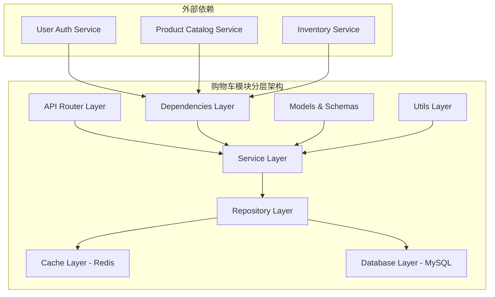
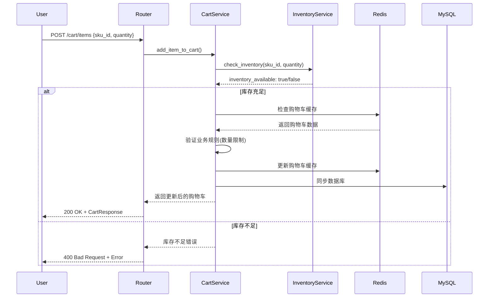
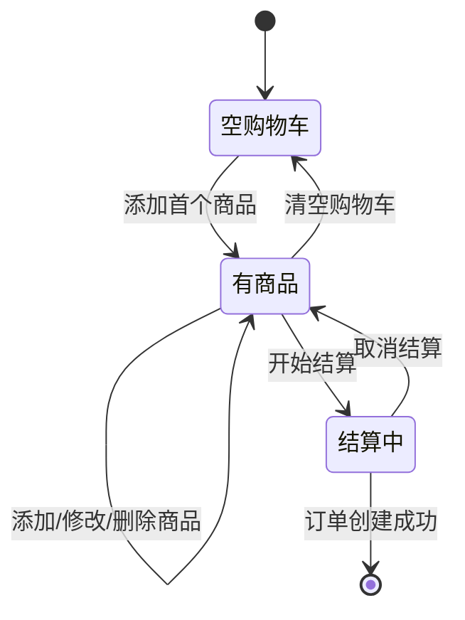

<!--
文档说明：
- 内容：模块技术设计文档模板
- 作用：记录技术设计决策、架构选择、实现方案
- 使用方法：基于需求文档进行技术设计，记录设计理由
-->

# 购物车模块 - 技术设计文档

📅 **创建日期**: 2025-09-16  
👤 **设计者**: 系统架构师  
✅ **评审状态**: 设计中  
🔄 **最后更新**: 2025-09-16  

## 设计概述

### 设计目标
- **高性能**: 支持8000并发用户，API响应时间<100ms，缓存命中率>85%
- **高可用**: 99.9%系统可用性，Redis故障自动降级，数据一致性保证
- **高扩展**: 支持水平扩展，模块化设计便于功能扩展

### 设计原则
- **单一职责**: 购物车模块专注于购物车数据管理，不涉及订单创建和支付处理
- **开放封闭**: 通过接口抽象实现扩展性，支持新增促销规则和推荐算法
- **依赖倒置**: 依赖抽象接口而非具体实现，便于单元测试和系统解耦

### 关键设计决策
| 决策点 | 选择方案 | 理由 | 替代方案 |
|--------|----------|------|----------|
| 缓存策略 | Redis主存储+MySQL备份 | 性能优先，故障降级 | 纯MySQL存储 |
| 数据一致性 | 最终一致性+双写策略 | 平衡性能和一致性 | 强一致性事务 |
| 库存验证 | 实时调用库存服务 | 数据准确性保证 | 本地缓存库存 |
| 数量限制 | 应用层验证+数据库约束 | 多层防护机制 | 仅数据库约束 |

## 系统架构设计

### 整体架构


### 模块内部架构
```
shopping_cart/
├── router.py           # API路由层: FastAPI路由定义，请求响应处理
├── service.py          # 业务逻辑层: 购物车操作、价格计算、库存验证
├── models.py           # 数据模型层: SQLAlchemy ORM模型定义
├── schemas.py          # 数据传输对象: Pydantic请求响应模型
├── dependencies.py     # 依赖注入层: 认证、权限、服务依赖管理
└── README.md           # 模块文档: 快速导航和使用说明
```

### 层次职责
- **API层**: 处理HTTP请求响应，参数验证，认证授权，错误处理和响应格式统一
- **业务层**: 实现购物车业务逻辑，库存验证，价格计算，业务规则校验，外部服务调用
- **数据层**: 数据持久化，缓存管理，数据库操作，事务控制，数据一致性保证

## 数据库设计

### 表结构设计
```sql
-- 购物车主表
CREATE TABLE carts (
    id INTEGER PRIMARY KEY AUTO_INCREMENT,
    user_id INTEGER NOT NULL UNIQUE COMMENT '用户ID，唯一约束确保每用户一个购物车',
    created_at DATETIME DEFAULT CURRENT_TIMESTAMP COMMENT '创建时间',
    updated_at DATETIME DEFAULT CURRENT_TIMESTAMP ON UPDATE CURRENT_TIMESTAMP COMMENT '更新时间',
    INDEX idx_user_id (user_id),
    FOREIGN KEY (user_id) REFERENCES users(id) ON DELETE CASCADE
) ENGINE=InnoDB CHARSET=utf8mb4 COMMENT='用户购物车主表';

-- 购物车商品项表
CREATE TABLE cart_items (
    id INTEGER PRIMARY KEY AUTO_INCREMENT,
    cart_id INTEGER NOT NULL COMMENT '购物车ID',
    sku_id INTEGER NOT NULL COMMENT '商品SKU ID',
    quantity INT NOT NULL DEFAULT 1 COMMENT '商品数量',
    unit_price DECIMAL(10,2) NOT NULL COMMENT '加入时的商品单价',
    created_at DATETIME DEFAULT CURRENT_TIMESTAMP COMMENT '创建时间',
    updated_at DATETIME DEFAULT CURRENT_TIMESTAMP ON UPDATE CURRENT_TIMESTAMP COMMENT '更新时间',
    UNIQUE KEY uk_cart_sku (cart_id, sku_id),
    INDEX idx_cart_id (cart_id),
    INDEX idx_sku_id (sku_id),
    FOREIGN KEY (cart_id) REFERENCES carts(id) ON DELETE CASCADE,
    FOREIGN KEY (sku_id) REFERENCES products(id) ON DELETE CASCADE,
    CONSTRAINT chk_quantity CHECK (quantity > 0 AND quantity <= 999)
) ENGINE=InnoDB CHARSET=utf8mb4 COMMENT='购物车商品项表';
```

### 索引设计
| 表名 | 索引名 | 索引字段 | 索引类型 | 用途 |
|------|--------|----------|----------|------|
| carts | idx_user_id | user_id | BTREE | 根据用户ID查找购物车 |
| cart_items | uk_cart_sku | cart_id, sku_id | UNIQUE | 确保购物车中SKU唯一性 |
| cart_items | idx_cart_id | cart_id | BTREE | 查询购物车所有商品 |
| cart_items | idx_sku_id | sku_id | BTREE | 商品相关查询优化 |

### 数据关系
- **一对一**: User与Cart一对一关系，每个用户只有一个活跃购物车
- **一对多**: Cart与CartItem一对多关系，一个购物车包含多个商品项
- **外键约束**: cart_id关联carts表，sku_id关联products表，user_id关联users表

## API设计

### API架构
- **基础路径**: `/api/v1/cart/`
- **认证方式**: JWT Bearer Token
- **数据格式**: JSON
- **幂等性**: PUT/DELETE操作保证幂等性

### 端点设计
| 方法 | 路径 | 功能 | 请求参数 | 响应格式 |
|------|------|------|----------|----------|
| POST | `/api/v1/cart/items` | 添加商品到购物车 | `{sku_id, quantity}` | `CartResponse` |
| GET | `/api/v1/cart` | 获取购物车内容 | 无 | `CartResponse` |
| PUT | `/api/v1/cart/items/{item_id}` | 更新商品数量 | `{quantity}` | `CartResponse` |
| DELETE | `/api/v1/cart/items/{item_id}` | 删除单个商品 | 无 | `SuccessResponse` |
| DELETE | `/api/v1/cart/items` | 批量删除商品 | `{item_ids: []}` | `SuccessResponse` |
| DELETE | `/api/v1/cart` | 清空购物车 | 无 | `SuccessResponse` |

### 错误处理设计
```json
{
    "error": {
        "code": "CART_ERROR_001",
        "message": "库存不足，当前可用库存：5个",
        "details": {
            "sku_id": 12345,
            "requested_quantity": 10,
            "available_stock": 5
        }
    }
}
```

### 响应格式标准
```json
// 成功响应
{
    "success": true,
    "data": {
        "cart_id": 123,
        "items": [...],
        "total_amount": 299.99,
        "total_quantity": 3
    }
}

// 错误响应  
{
    "success": false,
    "error": {
        "code": "CART_ERROR_002",
        "message": "商品不存在或已下架"
    }
}
```

## 业务逻辑设计

### 核心业务流程


### 业务规则实现
- **库存验证规则**: 调用InventoryService实时验证库存，库存不足时抛出业务异常
- **数量限制规则**: Service层验证单商品数量≤999，购物车商品种类≤50
- **用户权限规则**: 通过JWT Token获取用户ID，确保用户只能操作自己的购物车
- **价格计算规则**: 根据商品当前价格×数量计算小计，汇总计算购物车总价

### 状态机设计


## 集成设计

### 模块依赖
- **user_auth模块**: JWT Token验证、用户身份识别、权限检查
- **product_catalog模块**: 商品信息查询、价格获取、商品状态验证
- **inventory_management模块**: 实时库存查询、库存预占、库存释放

### 外部服务集成
| 服务名 | 集成方式 | 用途 | 容错机制 |
|--------|----------|------|----------|
| UserAuthService | 依赖注入 | 用户认证和权限验证 | 认证失败返回401错误 |
| ProductCatalogService | HTTP调用 | 商品信息和价格查询 | 缓存商品基础信息，降级处理 |
| InventoryService | HTTP调用 | 库存验证和更新 | 预设安全库存，失败时禁止操作 |

### 事件设计
- **发布事件**: 
  - `CartItemAdded`: 商品添加到购物车事件
  - `CartItemRemoved`: 商品从购物车移除事件
  - `CartCleared`: 购物车清空事件
- **订阅事件**: 
  - `ProductPriceChanged`: 商品价格变更，更新购物车缓存
  - `ProductDiscontinued`: 商品下架，标记购物车项为不可用

## 性能设计

### 缓存策略
- **购物车缓存**: Redis存储用户购物车数据，Key:`cart:user:{user_id}`，TTL:1小时
- **商品信息缓存**: 本地缓存商品基础信息，减少对ProductCatalog服务的调用
- **缓存失效**: 写操作时立即更新缓存，定时任务清理过期数据

### 数据库优化
- **查询优化**: 使用复合索引(cart_id, sku_id)，避免全表扫描，批量查询减少数据库往返
- **连接池**: 配置最大20个连接，最小5个连接，空闲超时30秒
- **读写分离**: 当前不需要，未来可根据负载情况考虑读写分离

### 异步处理
- **缓存同步**: 使用后台任务定期同步Redis和MySQL数据一致性
- **事件发布**: 异步发布购物车变更事件，不阻塞主要业务流程
- **队列设计**: {队列方案}

## 安全设计

### 认证授权
- **认证方式**: JWT Token
- **权限控制**: RBAC模型
- **API安全**: 接口防护措施

### 数据安全
- **敏感数据**: {加密方案}
- **数据脱敏**: {脱敏规则}
- **审计日志**: {日志内容}

### 输入验证
- **参数校验**: Pydantic模型验证
- **SQL注入**: 参数化查询
- **XSS防护**: 输出编码

## 可扩展性设计

### 水平扩展
- **无状态设计**: 购物车服务不保存会话状态，所有状态存储在Redis/MySQL中
- **负载均衡**: 支持多实例部署，通过Nginx/ALB进行负载分发
- **数据分片**: Redis按用户ID分片，数据库支持水平分库分表

### 垂直扩展
- **资源配置**: 推荐4核8GB内存起步，可根据负载弹性扩展到16核32GB
- **性能监控**: 监控CPU使用率、内存使用率、数据库连接数等关键指标

### 降级策略
- **限流**: API网关层限制每用户每秒最多10次购物车操作
- **熔断**: Redis连接失败率>50%时熔断，降级到MySQL直连
- **降级**: 外部服务调用失败时使用缓存数据，保证核心功能可用

## 监控设计

### 业务监控
- **业务指标**: 购物车添加成功率、平均商品数量、购物车到订单转化率
- **告警规则**: 添加失败率>5%告警，库存验证失败率>10%告警

### 技术监控
- **性能指标**: API响应时间<100ms、QPS峰值、错误率<1%
- **资源指标**: CPU使用率<80%、内存使用率<85%、Redis内存使用率<90%
- **日志监控**: ERROR级别日志实时告警、慢查询(>100ms)监控

## 测试策略

### 单元测试
- **测试覆盖**: Service层业务逻辑100%覆盖，Repository层95%覆盖
- **测试框架**: pytest + pytest-asyncio + factory-boy
- **Mock策略**: Mock外部服务调用(InventoryService、ProductService)，使用内存数据库

### 集成测试
- **测试范围**: 完整API接口测试，数据库集成测试，Redis集成测试
- **测试环境**: 使用Docker Compose搭建测试环境(MySQL+Redis+应用)
- **测试数据**: Factory Boy生成测试数据，每个测试后自动清理

### 性能测试
- **压测目标**: 8000并发用户，95%请求响应时间<100ms，错误率<1%
- **测试场景**: 添加商品、查看购物车、批量操作等核心场景压测

## 实施计划

### 开发阶段
1. **阶段1**: 数据模型设计和基础框架搭建 (2天)
2. **阶段2**: 核心业务逻辑实现和Redis集成 (3天)
3. **阶段3**: API接口实现和外部服务集成 (2天)
4. **阶段4**: 测试完善和性能优化 (2天)

### 风险控制
- **技术风险**: {风险和缓解}
- **进度风险**: {风险和缓解}
- **质量风险**: {风险和缓解}

## 变更记录

| 日期 | 版本 | 变更内容 | 变更人 |
|------|------|----------|--------|
| 2025-09-16 | v1.0 | 初始设计 | {姓名} |
