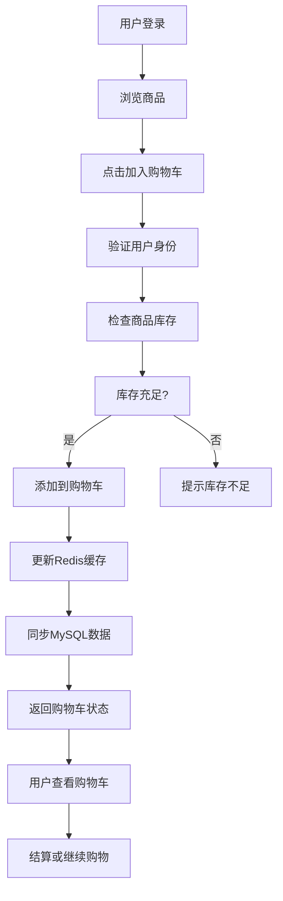

# 购物车模块 - 业务需求文档

📅 **创建日期**: 2025-09-16  
👤 **需求方**: 产品经理  
✅ **评审状态**: 已确认  
🔄 **最后更新**: 2025-09-16  

## 业务背景

### 业务目标
购物车是电商平台的核心功能，直接影响用户体验和转化率。通过提供便捷、可靠的购物车服务，提升用户购物体验，增加客单价和复购率。

### 业务场景
- **浏览购物场景**: 用户浏览商品时，可以随时将心仪商品加入购物车，暂存购买意向
- **购物车管理场景**: 用户可以查看、修改、删除购物车中的商品，调整购买策略
- **结算准备场景**: 用户在购物车中整理商品后，进入订单创建流程

### 成功指标
- **转化率提升**: 购物车使用率 > 80%，购物车到订单转化率 > 65%
- **性能指标**: API响应时间 < 100ms，支持8000并发用户

## 功能需求

### 核心功能列表
| 功能ID | 功能名称 | 优先级 | 业务价值 | 验收标准 |
|--------|----------|--------|----------|----------|
| CART-F001 | 商品添加到购物车 | P0 | 核心购物功能，转化用户购买意向 | 支持商品添加、库存验证、数量控制 |
| CART-F002 | 购物车内容查看 | P0 | 用户查看选购商品，决策支持 | 完整商品信息、价格计算、实时库存 |
| CART-F003 | 购物车商品修改 | P0 | 用户调整购买数量，优化购物体验 | 数量修改、价格更新、库存重验 |
| CART-F004 | 购物车商品删除 | P0 | 用户移除不需要的商品 | 单项删除、批量删除、清空购物车 |
| CART-F005 | 实时库存验证 | P0 | 防止超卖，保证商品可用性 | 添加时验证、查看时检查、结算前确认 |
| CART-F006 | 价格计算服务 | P0 | 提供准确价格信息 | 小计计算、总价计算、优惠预留接口 |

### 详细功能描述

#### CART-F001: 商品添加到购物车
- **业务描述**: 用户在商品详情页或商品列表页可以将商品添加到购物车，系统需要验证商品状态和库存可用性
- **用户故事**: 作为注册用户，我希望能够将心仪的商品添加到购物车，以便后续统一结算购买
- **前置条件**: 用户已登录，商品状态为上架，库存数量充足
- **业务规则**: 
  - 规则1: 用户必须登录后才能添加商品到购物车
  - 规则2: 添加前必须验证商品库存，库存不足时禁止添加
  - 规则3: 同一SKU商品合并计数，总数量不超过999个
  - 规则4: 购物车最多包含50个不同SKU商品
- **异常处理**: 库存不足时提示用户，商品下架时阻止添加并提示

#### CART-F002: 购物车内容查看
- **业务描述**: 用户可以查看购物车中所有商品的详细信息，包括商品名称、价格、数量、小计等
- **用户故事**: 作为用户，我希望随时查看购物车内容，了解已选商品和总价信息，便于决策
- **前置条件**: 用户已登录，拥有购物车数据
- **业务规则**:
  - 规则1: 显示商品最新价格和库存状态
  - 规则2: 实时计算各项小计和购物车总价
  - 规则3: 标识库存不足或商品下架状态
  - 规则4: 支持分页显示，每页最多20个商品项
- **异常处理**: 商品信息缺失时显示默认信息，价格异常时重新计算

#### CART-F003: 购物车商品修改
- **业务描述**: 用户可以修改购物车中商品的数量，系统重新计算价格并验证库存
- **用户故事**: 作为用户，我希望能够调整购物车中商品数量，灵活控制购买数量
- **前置条件**: 用户已登录，购物车中存在该商品
- **业务规则**:
  - 规则1: 修改数量时重新验证库存可用性
  - 规则2: 数量必须为1-999之间的正整数
  - 规则3: 数量为0时等同于删除商品
  - 规则4: 修改后实时更新价格计算
- **异常处理**: 库存不足时限制到最大可用库存，并提示用户

#### CART-F004: 购物车商品删除
- **业务描述**: 用户可以从购物车中删除不需要的商品，支持单项删除和批量操作
- **用户故事**: 作为用户，我希望能够移除不需要的商品，保持购物车整洁
- **前置条件**: 用户已登录，购物车中存在商品
- **业务规则**:
  - 规则1: 支持单个商品删除操作
  - 规则2: 支持选择多个商品批量删除
  - 规则3: 支持一键清空整个购物车
  - 规则4: 删除后重新计算购物车总价
- **异常处理**: 删除失败时回滚操作，并提示用户重试

## 非功能需求

### 性能要求
- **响应时间**: API接口响应时间 < 100ms (P95)
- **并发用户**: 支持8000并发用户同时操作购物车
- **数据量**: 支持单用户购物车50个SKU，平台100万活跃购物车

### 可用性要求
- **系统可用性**: 99.9% SLA，年停机时间 < 8.76小时
- **故障恢复**: Redis缓存故障时自动降级到MySQL，恢复时间 < 30秒

### 安全要求
- **数据安全**: 购物车数据加密存储，传输使用HTTPS协议
- **访问控制**: JWT Token认证，用户只能操作自己的购物车数据

### 扩展性要求
- **用户增长**: 支持从10万用户扩展到1000万用户规模
- **功能扩展**: 预留优惠券、促销活动、推荐算法等扩展接口

## 业务约束

### 合规要求
- {合规要求1}
- {合规要求2}

### 时间约束
- **交付时间**: {具体时间}
- **里程碑**: {关键时间节点}

### 资源约束
- **人力资源**: {资源限制}
- **技术约束**: {技术限制}

## 用户角色和权限

### 用户角色定义
| 角色名称 | 角色描述 | 权限范围 |
|----------|----------|----------|
| 注册用户 | 平台注册的普通用户 | 管理个人购物车、查看商品价格 |
| 系统管理员 | 平台运维和管理人员 | 查看所有购物车数据、清理异常数据 |
| 客服人员 | 客户服务支持人员 | 查看用户购物车、协助处理问题 |

### 权限矩阵
| 功能 | 注册用户 | 客服人员 | 系统管理员 |
|------|---------|---------|------------|
| 添加商品到购物车 | ✅ | ❌ | ❌ |
| 查看个人购物车 | ✅ | 🔍 | 🔍 |
| 修改购物车商品 | ✅ | ❌ | ❌ |
| 删除购物车商品 | ✅ | ❌ | ❌ |
| 查看其他用户购物车 | ❌ | ✅ | ✅ |
| 购物车数据统计 | ❌ | ✅ | ✅ |
| 系统配置管理 | ❌ | ❌ | ✅ |

## 业务流程

### 主要业务流程

### 异常流程
- **库存不足异常**: 商品库存不足时，系统提示用户库存数量，建议调整购买数量或移除商品
- **商品下架异常**: 商品下架后，购物车中该商品标记为不可用，建议用户移除或选择替代商品
- **缓存故障异常**: Redis缓存不可用时，系统自动降级到MySQL直接读写，确保功能可用性
- **并发冲突异常**: 多个请求同时修改购物车时，使用乐观锁机制，失败请求自动重试

## 数据需求

### 核心业务实体
| 实体名称 | 业务含义 | 核心属性 |
|----------|----------|----------|
| 购物车 | 用户的商品购买清单 | 用户ID、创建时间、更新时间、状态 |
| 购物车项 | 购物车中的单个商品项 | 购物车ID、SKU_ID、数量、加入时间、商品价格 |
| 商品库存 | 商品的库存信息 | SKU_ID、可用库存、预占库存、总库存 |

### 数据规则
- **唯一性**: 每个用户只有一个活跃购物车，购物车项以(购物车ID, SKU_ID)为唯一标识
- **完整性**: 购物车项必须关联有效的购物车和SKU，数量必须为正整数
- **一致性**: Redis缓存与MySQL数据保持最终一致性，库存数据实时同步

## 验收标准

### 功能验收
- [ ] 用户可以成功添加商品到购物车，系统验证库存并正确存储
- [ ] 用户可以查看购物车完整内容，价格计算准确无误
- [ ] 用户可以修改购物车商品数量，系统重新验证库存和价格
- [ ] 用户可以删除购物车商品，支持单项和批量删除操作
- [ ] 系统实时验证商品库存，库存不足时正确提示和限制
- [ ] 购物车数据在Redis和MySQL之间保持一致性

### 性能验收
- [ ] 所有API接口响应时间 < 100ms（P95性能测试）
- [ ] 支持1000并发用户同时操作购物车无性能瓶颈
- [ ] Redis缓存命中率 > 85%，减少数据库压力
- [ ] 单次购物车操作数据库查询次数 < 3次

### 安全验收
- [ ] 用户身份认证完整，只能操作自己的购物车数据
- [ ] 所有API接口实施访问控制，防止未授权访问
- [ ] 数据传输全程HTTPS加密，敏感信息安全保护
- [ ] 实施API限流机制，防止恶意刷购物车接口

## 风险和依赖

### 业务风险
- **库存超卖风险**: 高并发场景下可能出现库存数据不一致，缓解措施：使用Redis分布式锁+数据库行锁
- **缓存穿透风险**: 大量请求访问不存在的购物车数据，缓解措施：空值缓存+布隆过滤器
- **数据丢失风险**: Redis缓存故障可能导致购物车数据丢失，缓解措施：双写MySQL+定期备份

### 外部依赖
- **用户认证服务**: 依赖user_auth模块提供用户身份验证，影响所有购物车操作的权限控制
- **商品信息服务**: 依赖product_catalog模块提供商品详情和价格信息，影响购物车展示
- **库存管理服务**: 依赖inventory_management模块提供实时库存查询，影响库存验证功能
- **Redis缓存服务**: 依赖Redis集群提供高性能缓存，影响系统整体性能表现

## 变更记录

| 日期 | 版本 | 变更内容 | 变更人 |
|------|------|----------|--------|
| 2025-09-16 | v1.0 | 根据functional.md需求创建购物车业务需求文档 | 系统架构师 |
