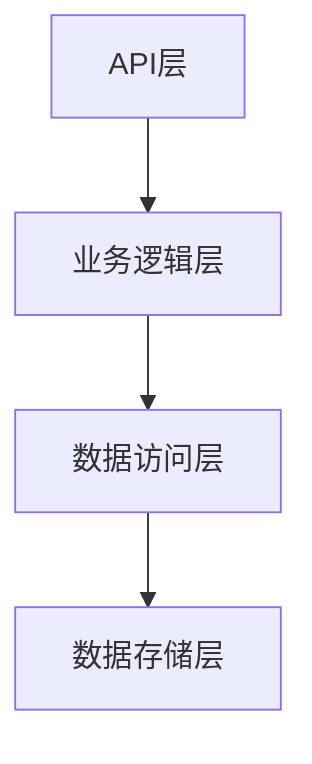
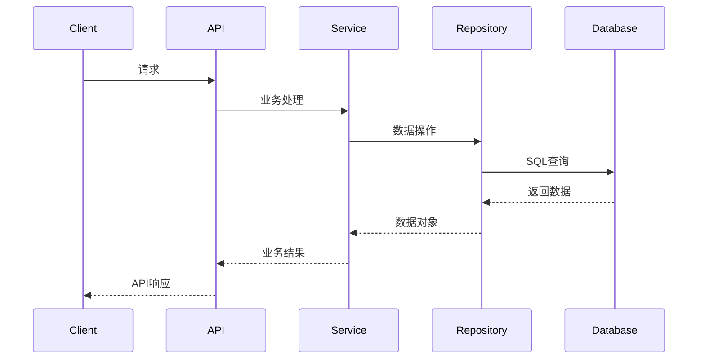
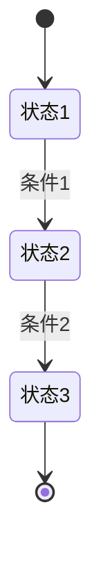

<!--
文档说明：
- 内容：模块技术设计文档模板
- 作用：记录技术设计决策、架构选择、实现方案
- 使用方法：基于需求文档进行技术设计，记录设计理由
-->

# user-auth模块 - 技术设计文档

📅 **创建日期**: 2025-09-16  
👤 **设计者**: {技术负责人}  
✅ **评审状态**: {设计中|待评审|已评审|已确认}  
🔄 **最后更新**: 2025-09-16  

## 设计概述

### 设计目标
- {设计目标1}
- {设计目标2}
- {设计目标3}

### 设计原则
- **单一职责**: {如何体现}
- **开放封闭**: {如何实现}
- **依赖倒置**: {依赖关系设计}

### 关键设计决策
| 决策点 | 选择方案 | 理由 | 替代方案 |
|--------|----------|------|----------|
| {决策1} | {选择方案} | {选择理由} | {其他方案} |
| {决策2} | {选择方案} | {选择理由} | {其他方案} |

## 系统架构设计

### 整体架构


### 模块内部架构
```
{模块名}/
├── router.py           # API路由层
├── service.py          # 业务逻辑层
├── repository.py       # 数据访问层
├── models.py           # 数据模型层
├── schemas.py          # 数据传输对象
├── dependencies.py     # 依赖注入
└── utils.py            # 工具函数
```

### 层次职责
- **API层**: {职责描述}
- **业务层**: {职责描述}
- **数据层**: {职责描述}

## 数据库设计

### 表结构设计
```sql
-- {表名1}
CREATE TABLE {table_name1} (
    id INT PRIMARY KEY AUTO_INCREMENT,
    -- 字段定义
    created_at DATETIME DEFAULT CURRENT_TIMESTAMP,
    updated_at DATETIME DEFAULT CURRENT_TIMESTAMP ON UPDATE CURRENT_TIMESTAMP
);

-- {表名2}
CREATE TABLE {table_name2} (
    -- 表结构
);
```

### 索引设计
| 表名 | 索引名 | 索引字段 | 索引类型 | 用途 |
|------|--------|----------|----------|------|
| {表名} | {索引名} | {字段列表} | {BTREE/UNIQUE} | {查询场景} |

### 数据关系
- **一对多**: {关系描述}
- **多对多**: {关系描述}
- **外键约束**: {约束说明}

## API设计

### API架构
- **基础路径**: `/api/v1/user-auth/`
- **认证方式**: JWT Bearer Token
- **数据格式**: JSON

### 端点设计
| 方法 | 路径 | 功能 | 请求参数 | 响应格式 |
|------|------|------|----------|----------|
| POST | `/api/v1/user-auth/{resource}` | {功能} | {参数} | {响应} |
| GET | `/api/v1/user-auth/{resource}` | {功能} | {参数} | {响应} |

### 错误处理设计
```json
{
    "error": {
        "code": "MODULE_ERROR_001",
        "message": "错误描述",
        "details": {}
    }
}
```

## 业务逻辑设计

### 核心业务流程


### 业务规则实现
- **规则1**: {实现方式}
- **规则2**: {实现方式}

### 状态机设计


## 集成设计

### 模块依赖
- **依赖模块1**: {依赖内容和接口}
- **依赖模块2**: {依赖内容和接口}

### 外部服务集成
| 服务名 | 集成方式 | 用途 | 容错机制 |
|--------|----------|------|----------|
| {服务1} | {REST/MQ} | {用途} | {容错方案} |
| {服务2} | {REST/MQ} | {用途} | {容错方案} |

### 事件设计
- **发布事件**: {事件列表和格式}
- **订阅事件**: {事件列表和处理}

## 性能设计

### 缓存策略
- **应用缓存**: Redis缓存{缓存内容}
- **查询缓存**: 缓存{查询结果}
- **缓存失效**: {失效策略}

### 数据库优化
- **查询优化**: {优化策略}
- **连接池**: {配置方案}
- **读写分离**: {是否需要}

### 异步处理
- **异步任务**: {任务类型}
- **队列设计**: {队列方案}

## 安全设计

### 认证授权
- **认证方式**: JWT Token
- **权限控制**: RBAC模型
- **API安全**: 接口防护措施

### 数据安全
- **敏感数据**: {加密方案}
- **数据脱敏**: {脱敏规则}
- **审计日志**: {日志内容}

### 输入验证
- **参数校验**: Pydantic模型验证
- **SQL注入**: 参数化查询
- **XSS防护**: 输出编码

## 可扩展性设计

### 水平扩展
- **无状态设计**: {如何实现}
- **负载均衡**: {方案选择}
- **数据分片**: {是否需要}

### 垂直扩展
- **资源配置**: {配置建议}
- **性能监控**: {监控指标}

### 降级策略
- **限流**: {限流策略}
- **熔断**: {熔断条件}
- **降级**: {降级方案}

## 监控设计

### 业务监控
- **业务指标**: {监控指标}
- **告警规则**: {告警条件}

### 技术监控
- **性能指标**: 响应时间、QPS、错误率
- **资源指标**: CPU、内存、磁盘
- **日志监控**: 错误日志、访问日志

## 测试策略

### 单元测试
- **测试覆盖**: 业务逻辑层100%覆盖
- **测试框架**: pytest
- **Mock策略**: {Mock方案}

### 集成测试
- **测试范围**: API接口测试
- **测试环境**: {环境配置}
- **测试数据**: {数据准备}

### 性能测试
- **压测目标**: {性能目标}
- **测试场景**: {测试用例}

## 实施计划

### 开发阶段
1. **阶段1**: 数据模型和API设计 ({时间})
2. **阶段2**: 核心业务逻辑实现 ({时间})
3. **阶段3**: 集成测试和优化 ({时间})

### 风险控制
- **技术风险**: {风险和缓解}
- **进度风险**: {风险和缓解}
- **质量风险**: {风险和缓解}

## 变更记录

| 日期 | 版本 | 变更内容 | 变更人 |
|------|------|----------|--------|
| 2025-09-16 | v1.0 | 初始设计 | {姓名} |
