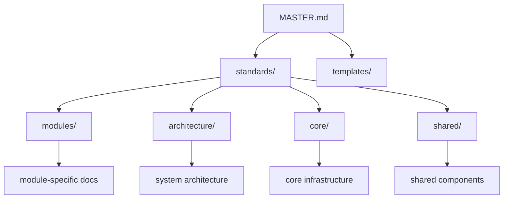

# 文档依赖关系管理规范

📝 **文档类型**: 文档架构和依赖关系规范  
📍 **作用**: 定义文档层次结构、引用关系规范和依赖管理规则  
🔗 **使用方法**: 创建或修改文档时参考依赖关系规范

## 📊 文档层次架构

### 层次结构图


### 层次职责定义

#### 第1层：控制层
- **MASTER.md**: 最高级别控制文档
- **职责**: 定义开发流程控制规则
- **依赖**: 无上级依赖
- **被依赖**: 所有开发活动

#### 第2层：标准层
- **standards/**: 开发规范和标准
- **templates/**: 文档模板
- **职责**: 定义技术标准和模板规范
- **依赖**: MASTER.md
- **被依赖**: 所有技术实施文档

#### 第3层：架构层
- **architecture/**: 系统架构设计
- **core/**: 核心基础设施文档
- **shared/**: 共享组件文档
- **职责**: 定义技术架构和基础设施
- **依赖**: standards/
- **被依赖**: 模块级实施文档

#### 第4层：实施层
- **modules/**: 业务模块文档
- **development/**: 开发指南
- **operations/**: 运维文档
- **职责**: 具体实施和操作指导
- **依赖**: architecture/, standards/
- **被依赖**: 具体开发工作

## 🔗 引用关系规范

### 引用路径格式

#### 相对路径规范
```
同级目录: ./file.md
上级目录: ../category/file.md
跨层级: ../../standards/naming-conventions.md
根目录: /docs/requirements/business.md
```

#### 标准引用模式
```markdown
<!-- 标准引用格式 -->
- [API设计规范](../../standards/api-standards.md) - 链接描述
- [用户认证模块](../modules/user-auth/overview.md) - 模块概述
- [系统架构](../architecture/overview.md) - 架构总览

<!-- 禁止的引用格式 -->
❌ [API规范](api-standards.md) - 缺少路径
❌ [用户认证](/docs/design/modules/user-auth/overview.md) - 绝对路径
❌ 点击这里查看API规范 - 无具体链接
```

### 引用层级规则

#### 向上引用（允许）
- ✅ 模块文档 → 标准文档
- ✅ 实施文档 → 架构文档
- ✅ 任何文档 → MASTER.md

#### 向下引用（谨慎）
- ⚠️ 标准文档 → 具体实施（需要抽象化）
- ⚠️ 架构文档 → 模块文档（仅作示例）

#### 平级引用（正常）
- ✅ 模块间相互引用
- ✅ 同类文档引用

#### 禁止引用（严格）
- ❌ 循环引用
- ❌ 跨层级直接引用（跳过中间层）

## 📋 依赖管理规则

### 强依赖关系

#### 模块文档内部依赖
```
每个模块的7个文档依赖顺序：
requirements.md → design.md → api-spec.md → implementation.md
                           ↗ api-implementation.md
overview.md ← README.md (汇总引用)
```

#### 跨模块依赖
```
被依赖模块更新 → 通知依赖模块
依赖模块检查 → 确认兼容性
版本管理 → 记录依赖关系变更
```

### 弱依赖关系

#### 参考性依赖
- 最佳实践参考
- 示例代码引用
- 相关概念说明

#### 管理原则
- 可选性更新
- 版本兼容性检查
- 废弃通知机制

### 依赖变更管理

#### 变更通知机制
```markdown
## 依赖变更通知模板

### 变更信息
- **影响文档**: [文档路径]
- **变更类型**: 接口变更|结构调整|内容更新
- **变更日期**: YYYY-MM-DD
- **影响范围**: 依赖此文档的所有文档

### 需要同步的文档
- [ ] docs/design/modules/user-auth/design.md
- [ ] docs/design/modules/product-catalog/api-spec.md

### 变更内容
{具体变更描述}
```

## 🚫 循环依赖检测

### 检测规则
1. **直接循环**: A → B → A
2. **间接循环**: A → B → C → A
3. **自引用**: A → A

### 检测方法
```powershell
# 使用脚本检测循环依赖
.\scripts\check_docs.ps1 -CheckCircularDependencies
```

### 解决策略
1. **重构依赖**: 拆分共同依赖到更高层
2. **接口抽象**: 通过接口层解耦
3. **版本管理**: 使用版本化接口

## 📁 目录引用映射

### 目录间引用关系
```
docs/
├── standards/          # 标准规范 (被所有文档引用)
│   ├── document-standards.md
│   ├── api-standards.md
│   └── naming-conventions.md
├── templates/          # 文档模板 (生成时引用)
├── architecture/       # 系统架构 (被实施文档引用)
├── core/              # 核心组件 (被模块引用)
├── shared/            # 共享组件 (被模块引用)
├── modules/           # 业务模块 (模块间相互引用)
├── development/       # 开发指南 (引用标准和架构)
├── operations/        # 运维文档 (引用架构和模块)
└── requirements/      # 需求文档 (被设计文档引用)
```

### 引用权重规则
| 引用类型 | 权重 | 说明 |
|----------|------|------|
| 强制依赖 | 高 | 必须满足的依赖关系 |
| 标准依赖 | 中 | 遵循标准规范的依赖 |
| 参考依赖 | 低 | 可选的参考性依赖 |

## 🔧 依赖管理工具

### 检查命令
```powershell
# 检查文档依赖关系
.\scripts\check_docs.ps1 -CheckDependencies

# 检查循环依赖
.\scripts\check_docs.ps1 -CheckCircularDependencies

# 生成依赖关系图
.\scripts\generate_dependency_graph.ps1

# 检查链接有效性
.\scripts\check_docs.ps1 -CheckLinks
```

### 自动化维护
```powershell
# 文档更新时自动检查依赖
.\scripts\update_dependencies.ps1 -DocumentPath "docs/design/modules/user-auth/"

# 批量更新引用
.\scripts\batch_update_references.ps1 -OldPath "modules/old-name" -NewPath "modules/new-name"
```

## 📊 依赖关系监控

### 监控指标
- **依赖深度**: 文档依赖层级数量
- **引用数量**: 被其他文档引用的次数
- **循环检测**: 是否存在循环依赖
- **链接有效性**: 引用链接是否有效

### 报告格式
```markdown
## 文档依赖关系报告

### 依赖统计
- 总文档数: 156
- 依赖关系数: 234
- 循环依赖: 0
- 无效链接: 3

### 高依赖文档（被引用最多）
1. standards/api-standards.md (被引用 23 次)
2. architecture/overview.md (被引用 18 次)
3. standards/naming-conventions.md (被引用 15 次)

### 需要关注的问题
- [ ] docs/design/modules/old-module/overview.md 存在无效引用
- [x] docs/development/tools.md 已重构为environment-setup.md和scripts-usage-manual.md
```

## 📝 最佳实践

### 文档创建时
1. **确认依赖**: 明确文档需要依赖哪些标准和架构文档
2. **检查引用**: 确保所有引用链接格式正确且有效
3. **避免循环**: 在引用前检查是否会形成循环依赖
4. **文档层次**: 遵循文档层次结构进行引用

### 文档更新时
1. **影响评估**: 评估更新对依赖文档的影响
2. **通知机制**: 通知相关文档维护者
3. **版本管理**: 记录变更对依赖关系的影响
4. **验证测试**: 确保依赖文档仍然有效

### 文档重构时
1. **依赖分析**: 分析现有依赖关系
2. **重构计划**: 制定依赖关系重构计划
3. **批量更新**: 使用工具批量更新引用
4. **验证检查**: 确保重构后依赖关系正确

## 🔄 版本管理

### 文档版本策略
- **主版本**: 重大架构变更
- **次版本**: 功能性更新
- **修订版**: 内容修正和优化

### 依赖版本兼容性
```markdown
## 版本兼容性矩阵

| 文档版本 | 依赖版本 | 兼容性 | 说明 |
|----------|----------|--------|------|
| v2.1.x | standards v2.0.x | ✅ | 完全兼容 |
| v2.1.x | standards v1.9.x | ⚠️ | 部分兼容 |
| v2.1.x | standards v1.8.x | ❌ | 不兼容 |
```

---

## 相关文档
- [文档管理规范](./document-standards.md) - 文档编写标准
- [API设计规范](./api-standards.md) - API文档规范
- [命名规范](./naming-conventions.md) - 命名统一标准
- [工作流程规范](./workflow-standards.md) - 开发流程标准