# 命名规范总纲 (Naming Conventions Master Guide)

## 🎯 命名规范原则

### 🚨 文档驱动开发强制原则
1. **文档优先于代码** - 任何代码实现前，必须先在文档中定义相关实体的命名
2. **命名优先于开发** - 实体命名必须在文档中确定后，才能进行相关开发工作
3. **一致性强制检查** - 同一实体在文档、数据库、API、代码中必须使用统一命名
4. **变更同步要求** - 任何命名变更必须同步更新所有相关文档和代码

### 📋 命名优先级（强制执行顺序）

```mermaid
graph LR
    A[1️⃣ 文档命名] --> B[2️⃣ 数据库命名]
    B --> C[3️⃣ API命名]
    C --> D[4️⃣ 代码命名]
    
    style A fill:#ff9999
    style B fill:#ffcc99
    style C fill:#99ccff
    style D fill:#99ff99
```


**优先级说明**:
1. **文档命名** (最高优先级) - 在模块文档中首先确定标准名称
2. **数据库命名** - 基于文档定义设计表名和字段名
3. **API命名** - 基于数据库设计确定端点和参数名
4. **代码命名** - 基于API设计确定函数、类、变量名

### 核心原则
1. **一致性原则**: 同类实体使用相同命名模式
2. **可预测性原则**: 根据规则可以预测名称
3. **可读性原则**: 名称自解释，避免缩写
4. **可维护性原则**: 支持重构和扩展

## 📚 模块命名规范

### 🎯 统一命名规范（最终版）

#### 原则说明
```
业务概念层（连字符）: user-auth, shopping-cart, product-catalog
├── 文档目录: docs/modules/user-auth/
├── API路由: /api/user-auth/login
└── 配置文件: user-auth.yaml

技术实现层（下划线）: user_auth, shopping_cart, product_catalog  
├── 代码目录: app/modules/user_auth/
├── 文件名: user_auth_router.py, user_auth_service.py
├── 函数名: authenticate_user(), register_user()
└── 类名: UserAuthService, UserAuthRouter
```

#### 模块核心名称定义
| 业务概念名 | 技术实现名 | 中文名称 | API路径前缀 | 代码目录 |
|------------|------------|----------|-------------|----------|
| `user-auth` | `user_auth` | 用户认证模块 | `/api/v1/user-auth/` | `app/modules/user_auth/` |
| `shopping-cart` | `shopping_cart` | 购物车模块 | `/api/v1/shopping-cart/` | `app/modules/shopping_cart/` |
| `product-catalog` | `product_catalog` | 商品管理模块 | `/api/v1/product-catalog/` | `app/modules/product_catalog/` |
| `order-management` | `order_management` | 订单管理模块 | `/api/v1/order-management/` | `app/modules/order_management/` |
| `payment-service` | `payment_service` | 支付服务模块 | `/api/v1/payment-service/` | `app/modules/payment_service/` |
| `batch-traceability` | `batch_traceability` | 批次溯源模块 | `/api/v1/batch-traceability/` | `app/modules/batch_traceability/` |
| `logistics-management` | `logistics_management` | 物流管理模块 | `/api/v1/logistics-management/` | `app/modules/logistics_management/` |
| `member-system` | `member_system` | 会员系统模块 | `/api/v1/member-system/` | `app/modules/member_system/` |
| `distributor-management` | `distributor_management` | 分销商管理模块 | `/api/v1/distributor-management/` | `app/modules/distributor_management/` |
| `marketing-campaigns` | `marketing_campaigns` | 营销活动模块 | `/api/v1/marketing-campaigns/` | `app/modules/marketing_campaigns/` |
| `social-features` | `social_features` | 社交功能模块 | `/api/v1/social-features/` | `app/modules/social_features/` |
| `inventory-management` | `inventory_management` | 库存管理模块 | `/api/v1/inventory-management/` | `app/modules/inventory_management/` |
| `notification-service` | `notification_service` | 通知服务模块 | `/api/v1/notification-service/` | `app/modules/notification_service/` |
| `supplier-management` | `supplier_management` | 供应商管理模块 | `/api/v1/supplier-management/` | `app/modules/supplier_management/` |
| `recommendation-system` | `recommendation_system` | 推荐系统模块 | `/api/v1/recommendation-system/` | `app/modules/recommendation_system/` |
| `customer-service-system` | `customer_service_system` | 客服系统模块 | `/api/v1/customer-service-system/` | `app/modules/customer_service_system/` |
| `risk-control-system` | `risk_control_system` | 风控系统模块 | `/api/v1/risk-control-system/` | `app/modules/risk_control_system/` |
| `data-analytics-platform` | `data_analytics_platform` | 数据分析模块 | `/api/v1/data-analytics-platform/` | `app/modules/data_analytics_platform/` |
| `application-core` | `application_core` | 应用核心模块 | - | `app/core/` |
| `database-core` | `database_core` | 数据库核心模块 | - | `app/core/database/` |
| `data-models` | `data_models` | 数据模型模块 | - | `app/shared/models/` |
| `redis-cache` | `redis_cache` | Redis缓存模块 | - | `app/core/cache/` |
| `database-utils` | `database_utils` | 数据库工具模块 | - | `app/core/utils/` |

### 文档目录命名规则
```
docs/
├── standards/                        # 开发标准（参考document-standards.md）
│   ├── openapi.yaml                  # API契约定义
│   └── ...                          # 其他标准文档
├── modules/{完整描述名}/              # 完整模块文档
│   ├── api-spec.md                   # API规范文档
│   ├── api-implementation.md         # API实施细节记录
│   └── ...                          # 其他模块文档
```

**示例**：
```
docs/standards/openapi.yaml              # 全局API契约
docs/modules/shopping-cart/api-spec.md    # 模块接口规范
docs/modules/shopping-cart/api-implementation.md # 模块实施记录
docs/modules/shopping-cart/overview.md
```

## 🗄️ 数据库命名规范

### 表命名
- **规则**: 模块英文名 + 复数形式
- **格式**: `{module_name}s` 或语义复数
- **示例**: `users`, `products`, `categories`, `orders`

### 字段命名
| 字段类型 | 命名规则 | 示例 |
|----------|----------|------|
| 主键 | `id` | `id` |
| 外键 | `{表名单数}_id` | `user_id`, `category_id` |
| 时间戳 | `{动作}_at` | `created_at`, `updated_at` |
| 布尔值 | `is_{状态}` | `is_active`, `is_deleted` |
| 状态 | `status` | `status` |
| 数量 | `{名称}_quantity` | `stock_quantity` |
| 金额 | `{名称}_amount` | `total_amount` |

### JSON字段命名
```python
# 商品属性JSON结构
attributes = {
    "color": "红色",
    "size": "大号", 
    "weight": "500g"
}

# 商品图片JSON结构  
images = [
    "https://example.com/image1.jpg",
    "https://example.com/image2.jpg"
]
```

## 🌐 API命名规范

### RESTful API路径规则
```
{base_url}/api/{module_name}/{resource}[/{resource_id}][/{sub_resource}]
```

### 标准API端点模式
| 操作 | HTTP方法 | 路径模式 | 示例 |
|------|----------|----------|------|
| 创建 | POST | `/api/{resources}` | `POST /api/products` |
| 列表 | GET | `/api/{resources}` | `GET /api/products` |
| 详情 | GET | `/api/{resources}/{id}` | `GET /api/products/123` |
| 更新 | PUT | `/api/{resources}/{id}` | `PUT /api/products/123` |
| 删除 | DELETE | `/api/{resources}/{id}` | `DELETE /api/products/123` |

### 特殊操作命名
| 操作类型 | 路径模式 | 示例 |
|----------|----------|------|
| 子资源 | `/api/{resources}/{id}/{sub_resources}` | `GET /api/orders/123/items` |
| 操作动作 | `/api/{resources}/{id}/{action}` | `POST /api/orders/123/cancel` |
| 状态更新 | `PATCH /api/{resources}/{id}/{field}` | `PATCH /api/orders/123/status` |

### 用户认证API规范
```
POST /api/auth/register     # 用户注册
POST /api/auth/login        # 用户登录  
POST /api/auth/refresh      # 刷新令牌
GET  /api/auth/me           # 获取当前用户
PUT  /api/auth/me           # 更新当前用户
POST /api/auth/logout       # 用户登出
POST /api/auth/change-password  # 修改密码
```

## 🔧 代码文件命名规范

### Python文件命名
| 文件类型 | 命名规则 | 示例 |
|----------|----------|------|
| 路由文件 | `{module_name}_routes.py` | `user_routes.py` |
| 模型文件 | `models.py` (统一) | `models.py` |
| Schema文件 | `schemas.py` (统一) | `schemas.py` |
| 服务文件 | `{module_name}_service.py` | `user_service.py` |
| 工具文件 | `{module_name}_utils.py` | `cart_utils.py` |

### 函数命名规则
```python
# API路由函数命名: {动作}_{模块名}[_{资源}]
async def create_product(...)      # 创建商品
async def get_products(...)        # 获取商品列表
async def get_product(...)         # 获取单个商品
async def update_product(...)      # 更新商品
async def delete_product(...)      # 删除商品

# 业务逻辑函数命名: {动作}_{对象}[_{条件}]
def calculate_cart_total(...)      # 计算购物车总价
def validate_product_stock(...)    # 验证商品库存
def send_order_notification(...)   # 发送订单通知
```

### 类命名规则
```python
# Pydantic Schema命名: {资源名}{操作}
class ProductCreate(BaseModel):    # 创建商品Schema
class ProductRead(BaseModel):      # 读取商品Schema  
class ProductUpdate(BaseModel):    # 更新商品Schema

# SQLAlchemy Model命名: {资源名}(Pascal Case)
class User(Base):                  # 用户模型
class Product(Base):               # 商品模型
class Order(Base):                 # 订单模型
```

## 📝 变量和参数命名

### 变量命名规则
```python
# 单数 vs 复数
user = get_user(user_id)           # 单个对象用单数
users = get_users()                # 多个对象用复数
product_list = []                  # 列表类型显式标注

# 布尔变量
is_active = True                   # is_ 前缀
has_permission = False             # has_ 前缀  
can_edit = True                    # can_ 前缀

# 数量和金额
item_count = 5                     # count 后缀表示数量
total_amount = 100.50              # amount 后缀表示金额
stock_quantity = 20                # quantity 后缀表示库存
```

### 参数命名规则
```python
# API路径参数
@router.get("/products/{product_id}")
async def get_product(product_id: int):

# 查询参数  
@router.get("/products")
async def get_products(
    skip: int = 0,              # 分页跳过数量
    limit: int = 100,           # 分页限制数量  
    category_id: int = None,    # 筛选条件
    search: str = None          # 搜索关键词
):

# 请求体参数
async def create_product(
    product: ProductCreate,     # Schema对象
    db: Session = Depends(get_db),  # 依赖注入
    current_user: User = Depends(get_current_user)  # 当前用户
):
```

## 🔍 命名规范检查机制

### 自动化检查工具
```powershell
# 检查API端点命名规范
.\scripts\check_api_naming.ps1

# 检查数据库字段命名规范  
.\scripts\check_db_naming.ps1

# 检查文档目录命名规范
.\scripts\check_docs_naming.ps1

# 全面命名规范检查
.\scripts\check_naming_compliance.ps1
```

### 🚨 强制检查点设置

#### 开发阶段强制检查
1. **需求分析阶段**:
   - [ ] 确认业务实体命名规范
   - [ ] 建立实体命名映射表
   - [ ] 记录在需求文档中

2. **架构设计阶段**:
   - [ ] 确认模块标准命名
   - [ ] 设计数据模型命名
   - [ ] 定义API端点命名规范

3. **编码开发阶段** (🔒 强制):
   - [ ] **禁止无文档编码** - 文档未定义的实体严禁编写代码
   - [ ] **强制命名检查** - 所有代码实体必须遵循文档定义
   - [ ] **一致性验证** - 确保跨层级命名一致性

#### Git提交强制检查
```bash
# pre-commit hook 检查
- 命名规范合规性检查
- 文档与代码一致性检查  
- 跨层级命名一致性检查
- 违规阻止提交并给出修改建议
```

### 代码审查检查点
- [ ] API路径遵循RESTful规范
- [ ] 数据库字段遵循snake_case规范  
- [ ] 函数名称描述准确，动词+名词结构
- [ ] 类名使用PascalCase规范
- [ ] 变量名称语义明确，避免缩写

### 文档命名检查点
- [ ] 模块目录使用完整描述名
- [ ] API文档使用模块英文名
- [ ] 文档引用关系正确
- [ ] 命名与实际代码一致

## 🚨 命名规范执行

### 强制检查流程
1. **开发前检查**: 确认命名规范，更新命名字典
2. **编码中检查**: IDE插件实时检查命名规范
3. **提交前检查**: Git pre-commit hook验证命名
4. **代码审查**: 人工检查命名规范遵循情况

### 违规处理机制
- **警告**: 轻微不规范，记录但不阻止
- **阻止**: 严重不规范，拒绝提交
- **修正**: 提供自动修正建议
- **培训**: 团队命名规范培训

## 📈 规范演进机制

### 命名规范更新流程
1. 发现新的命名场景或问题
2. 团队讨论制定规范
3. 更新本文档和检查工具
4. 通知团队并培训
5. 执行新规范

### 历史代码迁移策略
1. **评估影响**: 分析现有代码不规范程度
2. **制定计划**: 分阶段迁移，优先级排序
3. **渐进迁移**: 新功能强制规范，旧代码逐步更新
4. **工具辅助**: 开发自动化重构工具
5. **验证测试**: 确保迁移不破坏功能

---

**重要提醒**: 此命名规范是**强制性标准**，所有新代码必须严格遵循，现有代码将按计划逐步更新。
