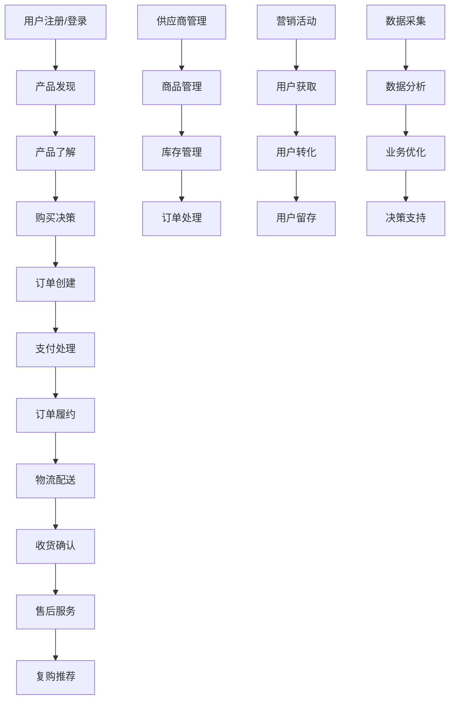

# 业务流程模型标准（Process Models Standards）

> **版本**: v1.0.0  
> **状态**: 执行中（Active）  
> **更新日期**: 2025-09-29  
> **发布单位**: 业务分析团队（Business Analysis Team）  
> **适用范围**: ecommerce_platform 项目全业务流程建模与子场景管理  

---

## 导航总览（Navigation Overview）

| 层级 | 内容重点 | 目标输出 | 覆盖范围 |
|------|----------|----------|----------|
| I. 业务全景层 | 端到端业务流程全景图 | 主流程图、关键节点、决策点 | 100%业务覆盖 |
| II. 场景分解层 | 核心业务场景细化 | 场景流程图、子流程定义 | 主要业务场景 |
| III. 子场景管理层 | 具体操作场景建模 | 详细用例、异常处理 | 关键操作场景 |

- [I. 业务全景层](#i-业务全景层)
- [II. 场景分解层](#ii-场景分解层)
- [III. 子场景管理层](#iii-子场景管理层)

---

## I. 业务全景层

### 1.1 电商平台端到端业务流程



### 1.2 核心业务域划分

| 业务域 | 核心职责 | 主要流程 | 关键指标 |
|--------|----------|----------|----------|
| **用户管理域** | 用户生命周期管理 | 注册登录、身份验证、权限管理 | 用户增长率、活跃度 |
| **商品管理域** | 商品全生命周期管理 | 商品上架、信息管理、下架处理 | 商品转化率、库存周转 |
| **交易管理域** | 交易流程端到端管理 | 下单、支付、履约、结算 | 交易成功率、客单价 |
| **营销管理域** | 营销活动和用户运营 | 活动策划、推广执行、效果分析 | 获客成本、转化率 |
| **供应链管理域** | 供应链协调和优化 | 采购、库存、物流、质量 | 库存周转、履约及时率 |
| **客服管理域** | 客户服务和体验管理 | 咨询处理、投诉解决、满意度 | 服务响应时间、满意度 |
| **数据管理域** | 数据驱动的业务优化 | 数据采集、分析、洞察、决策 | 数据准确性、洞察价值 |

### 1.3 业务流程成熟度评估

| 流程成熟度等级 | 描述 | 当前状态评估 | 目标状态 |
|----------------|------|--------------|----------|
| **L1 - 初始级** | 流程临时、不可重复 | 🔴 部分新功能 | 减少到最少 |
| **L2 - 可重复级** | 基本流程可重复执行 | 🟡 大部分核心流程 | 所有核心流程 |
| **L3 - 已定义级** | 流程标准化、文档化 | 🟢 关键交易流程 | 所有重要流程 |
| **L4 - 已管理级** | 流程可度量、可控制 | 🟡 部分关键流程 | 所有核心流程 |
| **L5 - 优化级** | 流程持续改进优化 | 🔴 待建立 | 关键业务域 |

---

## II. 场景分解层

### 2.1 核心业务场景矩阵

| 场景类别 | 主要场景 | 关键子场景 | 复杂度 | 优先级 |
|----------|----------|------------|--------|--------|
| **用户管理场景** | 用户注册登录 | 手机注册、微信登录、实名认证 | 中 | P0 |
| **商品交易场景** | 商品浏览购买 | 商品搜索、详情查看、规格选择、加购买 | 高 | P0 |
| **订单处理场景** | 订单全流程管理 | 下单、支付、发货、配送、收货 | 高 | P0 |
| **营销推广场景** | 营销活动管理 | 优惠券、拼团、分销、积分 | 中 | P1 |
| **供应链场景** | 供应商协作 | 入驻审核、商品上架、库存同步 | 中 | P1 |
| **客服服务场景** | 客户服务支持 | 在线咨询、投诉处理、售后服务 | 中 | P1 |
| **数据分析场景** | 业务数据洞察 | 用户行为、销售分析、运营优化 | 高 | P2 |
| **溯源验证场景** | 产品溯源查询 | 二维码扫描、溯源链查询、认证验证 | 高 | P0 |

### 2.2 场景详细流程定义

#### 2.2.1 用户注册登录场景

**场景描述**: 用户通过多种方式注册和登录平台

**主要子场景**:
1. **手机号注册登录**
   - 手机号验证 → 短信验证码 → 密码设置 → 注册完成
   - 手机号输入 → 密码验证 → 登录成功

2. **第三方登录**
   - 微信授权 → 获取用户信息 → 账户绑定 → 登录完成
   - 支付宝授权 → 获取用户信息 → 账户绑定 → 登录完成

3. **实名认证**
   - 身份证上传 → OCR识别 → 人脸验证 → 认证完成

**异常处理**:
- 验证码错误或超时
- 第三方授权失败
- 实名认证失败

#### 2.2.2 商品浏览购买场景

**场景描述**: 用户发现、了解并购买商品的完整流程

**主要子场景**:
1. **商品发现**
   - 首页推荐 → 分类浏览 → 搜索查找 → 商品列表

2. **商品了解**
   - 商品详情 → 图片查看 → 规格选择 → 评价查看 → 溯源查询

3. **购买决策**
   - 价格对比 → 优惠券选择 → 库存确认 → 加入购物车

4. **订单创建**
   - 购物车确认 → 收货地址 → 配送方式 → 支付方式 → 提交订单

**关键决策点**:
- 商品是否有库存？
- 用户是否享受会员价？
- 是否可以使用优惠券？
- 配送方式是否支持？

#### 2.2.3 订单处理场景

**场景描述**: 订单从创建到完成的全生命周期管理

**主要子场景**:
1. **订单创建与支付**
   - 订单生成 → 库存预占 → 支付处理 → 支付确认

2. **订单履约**
   - 订单审核 → 仓库拣货 → 打包发货 → 物流交接

3. **配送跟踪**
   - 物流跟踪 → 配送通知 → 收货确认 → 评价反馈

4. **异常处理**
   - 支付失败处理 → 库存不足处理 → 配送异常处理 → 退换货处理

**业务规则**:
- 订单超时未支付自动取消
- 库存不足时订单状态调整
- 配送异常时客服介入

#### 2.2.4 溯源验证场景（农产品特色）

**场景描述**: 用户通过扫码或查询验证产品溯源信息

**主要子场景**:
1. **溯源码扫描**
   - 二维码扫描 → 溯源码验证 → 产品信息展示

2. **溯源链查询**
   - 批次查询 → 生产信息 → 检测报告 → 物流轨迹

3. **认证验证**
   - 生产许可 → 质量认证 → 检测证书 → 认证机构

**溯源信息层级**:
- **基础信息**: 生产日期、产地、生产商
- **详细信息**: 种植记录、加工工艺、检测数据
- **认证信息**: 有机认证、质量认证、第三方检测

---

## III. 子场景管理层

### 3.1 关键子场景库存

| 子场景编号 | 子场景名称 | 场景描述 | 触发条件 | 业务价值 |
|------------|------------|----------|----------|----------|
| **USC-001** | 手机号注册 | 用户通过手机号完成注册 | 用户点击注册按钮 | 用户获取、转化 |
| **USC-002** | 微信快速登录 | 用户通过微信授权快速登录 | 用户选择微信登录 | 降低登录门槛 |
| **USC-003** | 实名认证 | 用户完成身份实名认证 | 用户点击实名认证 | 合规要求、信任建立 |
| **USC-004** | 商品搜索 | 用户通过关键词搜索商品 | 用户输入搜索词 | 提高购买效率 |
| **USC-005** | 商品详情查看 | 用户查看商品详细信息 | 用户点击商品 | 购买决策支持 |
| **USC-006** | 溯源信息查询 | 用户查询产品溯源信息 | 用户点击溯源按钮 | 信任建立、差异化 |
| **USC-007** | 购物车管理 | 用户管理购物车商品 | 用户操作购物车 | 购买便利性 |
| **USC-008** | 订单支付 | 用户完成订单支付 | 用户提交订单 | 交易转化 |
| **USC-009** | 物流跟踪 | 用户跟踪订单物流状态 | 订单发货后 | 用户体验、信任 |
| **USC-010** | 售后申请 | 用户申请退换货服务 | 用户发起售后 | 客户满意度 |
| **USC-011** | 分销推广 | 分销商推广产品获得佣金 | 分销商分享链接 | 渠道扩展 |
| **USC-012** | 优惠券使用 | 用户使用优惠券享受优惠 | 用户选择优惠券 | 营销转化 |
| **USC-013** | 积分兑换 | 用户使用积分兑换商品 | 用户选择积分支付 | 用户留存 |
| **USC-014** | 会员升级 | 用户达到条件自动升级会员 | 满足升级条件 | 用户价值提升 |
| **USC-015** | 库存预警 | 系统检测库存不足并预警 | 库存低于安全值 | 供应链优化 |

### 3.2 子场景处理规范

#### 3.2.1 子场景识别原则
1. **用户价值导向**: 每个子场景必须为用户创造明确价值
2. **业务完整性**: 子场景应该是完整的业务操作单元
3. **技术可实现**: 子场景应该能够通过现有技术实现
4. **异常可处理**: 每个子场景都应该有对应的异常处理机制

#### 3.2.2 子场景建模标准
```markdown
### 子场景模板
**子场景编号**: USC-XXX
**子场景名称**: [简洁名称]
**业务描述**: [1-2句话描述业务价值]
**触发条件**: [明确的触发条件]
**前置条件**: [执行前必须满足的条件]
**主流程步骤**:
1. [步骤1] - [具体操作]
2. [步骤2] - [具体操作]
3. [步骤N] - [具体操作]
**成功标准**: [明确的成功判断标准]
**异常处理**: [主要异常场景和处理方式]
**后置条件**: [执行后的系统状态]
**相关检查点**: [对应的CHECK点]
```

### 3.3 场景覆盖性分析

#### 3.3.1 业务流程覆盖矩阵

| 主流程节点 | 关键子场景 | 覆盖状态 | 检查点对应 | 缺失/补充 |
|------------|------------|----------|------------|-----------|
| 用户获取 | 注册登录、实名认证 | ✅ 完整覆盖 | REQ-001, DEV-001 | 无 |
| 商品发现 | 搜索、推荐、分类浏览 | ✅ 完整覆盖 | DEV-004, DEV-005 | 无 |
| 购买决策 | 详情查看、价格对比、溯源查询 | ✅ 完整覆盖 | DEV-003, DEV-005 | 无 |
| 交易处理 | 下单、支付、确认 | ✅ 完整覆盖 | DEV-004, DEV-006 | 无 |
| 订单履约 | 审核、发货、配送 | ✅ 完整覆盖 | DEV-005, TEST-004 | 无 |
| 客户服务 | 咨询、投诉、售后 | ✅ 完整覆盖 | DEV-007, TEST-005 | 无 |
| 营销推广 | 优惠券、分销、积分 | ✅ 完整覆盖 | DEV-005, TEST-002 | 需增强社交功能 |
| 数据分析 | 行为分析、业务洞察 | 🟡 部分覆盖 | TEST-006, DOC-003 | 需补充AI推荐 |
| 供应链管理 | 库存、采购、质量 | 🟡 部分覆盖 | DEV-011, TEST-004 | 需补充供应商协作 |
| 风险控制 | 反欺诈、异常检测 | 🟡 部分覆盖 | DEV-006, DEV-007 | 需补充智能风控 |

#### 3.3.2 场景补充建议

**需要补充的子场景**:
1. **USC-016 智能推荐** - 基于AI的个性化商品推荐
2. **USC-017 供应商协作** - 供应商入驻和商品管理协作
3. **USC-018 智能客服** - AI客服和智能问答
4. **USC-019 社交分享** - 商品分享和社交裂变
5. **USC-020 数据看板** - 实时业务数据展示和分析

**需要细化的场景**:
1. **溯源验证流程** - 需要细化不同产品类型的溯源标准
2. **冷链物流跟踪** - 需要细化温度监控和异常处理
3. **企业客户服务** - 需要细化B2B客户的特殊需求
4. **风险控制机制** - 需要细化各类风险的识别和处理

---

## 附录

### A. 业务术语词汇表

| 术语 | 定义 | 使用场景 |
|------|------|----------|
| **业务域** | 相关业务功能的逻辑分组 | 系统架构设计 |
| **子场景** | 完整业务操作的最小单元 | 功能设计和测试 |
| **检查点** | 业务流程中的质量控制点 | 开发和质量保证 |
| **溯源链** | 产品从生产到销售的完整记录 | 农产品溯源验证 |
| **履约** | 订单从确认到交付的执行过程 | 订单处理和物流 |

### B. 场景优先级评估准则

| 优先级 | 评估标准 | 典型场景 |
|--------|----------|----------|
| **P0 - 核心** | 直接影响交易成功的关键场景 | 登录、下单、支付、发货 |
| **P1 - 重要** | 影响用户体验和业务效率 | 搜索、客服、营销活动 |
| **P2 - 增值** | 提升竞争优势和差异化价值 | 智能推荐、数据分析 |
| **P3 - 扩展** | 未来发展和功能扩展 | 社交功能、高级分析 |

### C. 变更管理机制

1. **场景新增**: 需要业务分析团队评估和架构团队审核
2. **场景修改**: 需要影响评估和相关团队协调
3. **场景废弃**: 需要迁移方案和兼容性处理
4. **定期审查**: 每季度审查场景覆盖度和优化建议

---

*最后更新: 2025-09-29 | 下次审查: 2025-12-29*