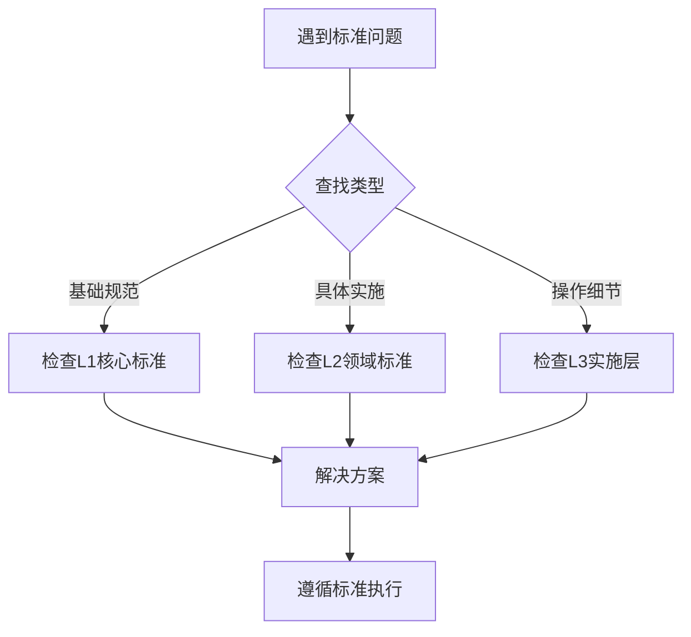

<!--version info: v1.0.0, created: 2025-09-23, level: L0, dependencies: none-->

<!--version info: v1.0.0, created: 2025-09-23, author: AI Assistant-->

# 开发标准导航总索引 🧭  
维护人：系统架构师
文档类型：L0层导航索引
更新频率：标准体系变更时
依赖关系：无上级依赖
被依赖：所有标准文档
关联决策：ADR-002 标准文档架构重构
-->

## 标准文档导航

### 🔍 关键词检索映射 (AI优化)
**直接跳转链接**：
- **目录结构** → [L1: project-structure-standards.md](#L1-project-structure-standards) ⭐ **最高权威**
- **命名规范** → [L1: naming-conventions.md](#L1-naming-conventions) ⭐ **全局规则**
- **工作流程** → [L1: workflow-standards.md](#L1-workflow-standards) ⭐ **SDLC标准**
- **代码规范** → [L2: code-standards.md](#L2-code-standards)
- **API设计** → [L2: api-standards.md](#L2-api-standards)  
- **数据库设计** → [L2: database-standards.md](#L2-database-standards)
- **测试规范** → [L2: testing-standards.md](#L2-testing-standards)
- **脚本管理** → [L2: scripts-standards.md](#L2-scripts-standards)
- **部署运维** → [L2: deployment-standards.md](#L2-deployment-standards)
- **文档管理** → [L2: document-standards.md](#L2-document-standards)
- **性能标准** → [L2: performance-standards.md](#L2-performance-standards)

### 🎯 常见问题快速定位
| 问题类型 | 直接答案位置 | 使用场景 |
|---------|-------------|---------|
| 这个目录应该放什么？ | [项目结构标准](project-structure-standards.md) | 新建目录或文件 |
| 这个变量怎么命名？ | [命名规范总纲](naming-conventions.md) | 编码时命名决策 |
| API路径怎么设计？ | [API设计标准](api-standards.md) | 创建新接口 |
| 数据表怎么设计？ | [数据库设计标准](database-standards.md) | 数据建模 |
| 测试怎么组织？ | [测试规范标准](testing-standards.md) | 编写测试用例 |
| 脚本放在哪里？ | [脚本管理标准](scripts-standards.md) | DevOps自动化 |
| 文档怎么写？ | [文档管理标准](document-standards.md) | 文档创建 |

## 📊 标准文档金字塔体系

### L0层：导航索引层 (本文档)
**职责**: 提供统一入口和快速检索  
**特点**: AI友好、关键词映射、零依赖

### L1层：核心标准层 (3个文档 - 权威定义)
**职责**: 定义全项目通用规则，其他标准必须遵循

| 🏗️ 标准名称 | 📄 文件名 | 🎯 覆盖范围 | 🔄 更新频率 | 🔗 依赖关系 |
|-------------|----------|------------|------------|------------|
| **项目结构标准** | [project-structure-standards.md](project-structure-standards.md) | 全项目目录结构权威定义 | 月度 | ⚡ 无依赖 |
| **命名规范总纲** | [naming-conventions.md](naming-conventions.md) | 全项目命名规则权威定义 | 月度 | ⬆️ 依赖项目结构 |
| **工作流程标准** | [workflow-standards.md](workflow-standards.md) | SDLC全流程 + AI检查点 | 季度 | ⬆️ 依赖项目结构 |

### L2层：领域标准层 (8个文档 - 专业实施)  
**职责**: 在L1基础上定义特定领域规则

**🔧 代码开发标准组**:
- **[api-standards.md](api-standards.md)** - RESTful API设计与实现规范
- **[code-standards.md](code-standards.md)** - 代码编写组织规范  
- **[database-standards.md](database-standards.md)** - 数据库设计规范

**🧪 测试质量标准组**:
- **[testing-standards.md](testing-standards.md)** - 五层测试体系架构规范
- **[performance-standards.md](performance-standards.md)** - 性能指标要求

**⚙️ 运维部署标准组**:
- **[scripts-standards.md](scripts-standards.md)** - DevOps脚本管理规范 ✨ **新建**
- **[deployment-standards.md](deployment-standards.md)** - 部署流程规范 ✨ **新建**

**📝 文档管理标准组**:
- **[document-standards.md](document-standards.md)** - 文档编写规范

### L3层：实施层 (按需扩展)
**职责**: 具体实施指南和操作细节
- 各目录的README.md文件 (如: `app/README.md`, `tests/README.md`)
- 检查清单和模板文件 (如: `templates/`, `analysis/`)
- 自动化验证脚本 (如: `scripts/check/`)

## 使用方法

### 🔄 引用规则 (强制执行)
1. **⬆️ 向上依赖**: L2必须引用L1，L3必须引用L2
2. **🚫 禁止同级引用**: 同层标准文档不能相互引用
3. **⭐ 单一权威源**: 每个规范只在一个文档中定义
4. **📝 明确引用格式**: `⬆️ **参考标准**: 参见 [文档名](路径)`

### 🔍 查找使用流程

### ⚡ 快速操作指南
**我需要...**
- 创建新目录 → 查看 [project-structure-standards.md](project-structure-standards.md)
- 命名变量/函数 → 查看 [naming-conventions.md](naming-conventions.md)  
- 设计API接口 → 查看 [api-standards.md](api-standards.md)
- 编写测试代码 → 查看 [testing-standards.md](testing-standards.md)
- 创建脚本工具 → 查看 [scripts-standards.md](scripts-standards.md)
- 写技术文档 → 查看 [document-standards.md](document-standards.md)

## 🛠️ 维护和更新规范

### 📊 版本控制标准
1. **版本信息**: 每个标准文档包含版本信息头部
2. **变更影响评估**: 更新前评估下游文档影响
3. **同步更新**: 标准变更时同步更新引用文档
4. **自动化检查**: 使用脚本验证引用关系完整性

### 🔄 更新维护流程
1. **评估影响范围** - 确定变更影响的下游文档
2. **版本号递增** - 按照语义版本规则更新
3. **同步更新依赖** - 更新所有引用此标准的文档  
4. **验证一致性** - 运行自动化验证脚本
5. **更新变更日志** - 记录变更原因和影响
6. **团队通知** - 通知相关开发人员标准变更

### 🚨 禁止操作清单
- ❌ 不经评估直接修改L1核心标准
- ❌ 创建新的标准文档不更新主索引  
- ❌ 修改引用关系不验证循环依赖
- ❌ 删除标准文档不评估下游影响
- ❌ 绕过本索引直接查找标准文档

## 🎯 标准体系质量保证

### ✅ 完整性验证
- [ ] 所有L2文档都正确引用L1标准
- [ ] 所有L3实施文档都正确引用L2标准  
- [ ] 无循环依赖关系
- [ ] 无重复内容定义
- [ ] 覆盖全开发生命周期

### 🔧 自动化工具支持  
- **验证脚本**: `scripts/check/validate_standards_consistency.ps1`
- **同步工具**: `scripts/sync_readme.ps1`
- **质量检查**: `scripts/check_docs.ps1`

---

## 📖 使用说明

### 🤖 给AI助手的使用提示
1. **优先使用本文档** 作为标准查找的入口点
2. **根据关键词映射** 快速定位到具体标准文档
3. **遵循引用层级** 确保标准权威性
4. **检查版本信息** 确保使用最新标准

### 👥 给开发人员的使用提示  
1. **收藏本文档** 作为日常开发标准参考
2. **按问题类型** 使用快速定位表格
3. **遵循更新流程** 维护标准文档质量
4. **及时反馈问题** 持续改进标准体系

---

**📋 检查点标记**: [CHECK:DOC-001] 代码文档同步验证  
**🔗 关联决策**: [ADR-002](../adr/ADR-002-standards-architecture-refactoring.md)  
**📅 最后更新**: 2025-09-23  
**👤 维护责任人**: 系统架构师
