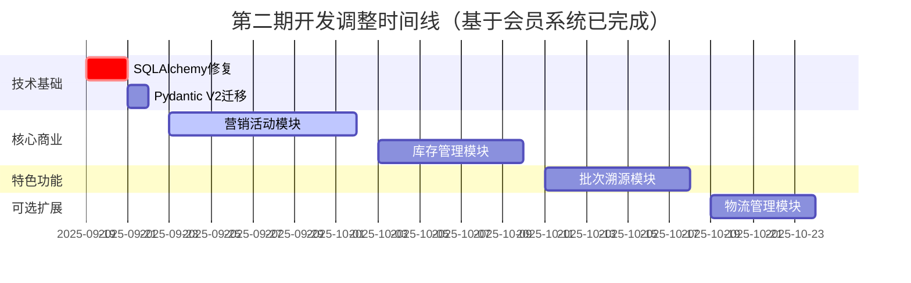

# 第二期开发具体工作计划（调整版）

**更新日期**: 2025年9月18日  
**基于**: 会员系统模块已完成，需重新调整开发优先级  
**计划周期**: 3-4周（原计划4-6周，因会员系统提前完成而压缩）  

## 🎉 当前进展概览

### ✅ 已完成模块（7个）
1. **第一期6个模块**: 用户认证、商品管理、购物车、订单管理、支付服务、质量控制
2. **会员系统** ✅ **提前完成** (2025-09-18) - 原计划P2，已达到生产就绪状态

### 📋 **调整后的开发优先级**

## 🔥 **Phase 2A: 技术债务清理** (Week 1, 3-4天)
**必须优先完成，阻塞性问题**

### 1. SQLAlchemy映射器问题修复 ⚡ **P0**
**问题描述**: 模块间关系映射配置冲突导致集成测试可能失败
**解决方案**: 
- 检查现有模型关系定义
- 重构冲突的外键配置
- 统一外键命名规范
- 验证所有模块间关系

**验收标准**:
- ✅ 所有集成测试通过
- ✅ 模型关系映射无冲突
- ✅ 外键约束一致性验证
- ✅ 数据库迁移脚本正常执行

**工期**: 2-3天

### 2. Pydantic V2迁移 ⚡ **P0**  
**问题描述**: Pydantic V1语法兼容性警告，影响长期维护
**解决方案**:
- 逐步迁移到Pydantic V2语法
- 使用ConfigDict替代Config类
- 更新所有模型验证逻辑
- 测试兼容性和性能影响

**验收标准**:
- ✅ 清除所有deprecation警告
- ✅ 所有模型使用V2语法
- ✅ 性能测试无回归
- ✅ API响应格式保持一致

**工期**: 1-2天

---

## 🚀 **Phase 2B: 核心商业模块** (Week 2-3, 16-18天)
**商业化能力建设，收入增长驱动**

### 3. 营销活动模块 (marketing_campaigns) 🎯 **P1**
**优先级提升原因**: 会员系统已完成，可立即集成营销功能实现商业闭环

**核心功能开发**:
- ✅ **优惠券系统** - 券码生成、发放规则、使用限制、核销统计
  - 支持多种券类型：满减券、折扣券、新人券、会员专享券
  - 灵活的发放规则：定向发放、批量发放、自动发放
  - 完整的使用限制：有效期、使用次数、商品限制、用户限制
- ✅ **促销活动** - 限时抢购、满减优惠、会员专享
  - 与会员系统集成，支持会员等级专享价格
  - 活动商品管理，库存同步
  - 活动效果实时统计和分析
- ✅ **营销工具** - 营销码、推广链接、效果追踪
  - ROI统计和转化分析
  - 营销活动A/B测试支持

**技术要求**:
- 与**会员系统深度集成**，利用已有的会员数据和权益体系
- 灵活的规则引擎支持复杂营销规则
- 与订单和支付系统集成，自动应用优惠
- 高并发优惠券发放和使用处理

**验收标准**:
- 与会员系统无缝集成，支持会员专享活动
- 优惠券系统稳定，支持高并发领取和使用
- 营销效果数据准确，ROI统计清晰
- 管理后台操作便捷，功能完整

**工期**: 8-10天

### 4. 库存管理模块 (inventory_management) 📦 **P1**
**优先级说明**: 电商核心基础设施，支撑所有业务模块

**核心功能开发**:
- ✅ **库存跟踪** - 实时库存、预占机制、安全库存预警
- ✅ **多仓库支持** - 仓库管理、库存调拨、区域库存
- ✅ **智能补货** - 基于销量预测的补货建议
- ✅ **批次库存** - 批次关联、先进先出、过期预警
- ✅ **会员库存** - 会员专享库存、会员预留机制

**技术要求**:
- 基于现有models.py扩展，保持架构一致性
- 实现高并发库存操作的原子性保证
- 与订单系统和**会员系统**紧密集成
- 支持会员等级库存预留策略

**验收标准**:
- 支持并发库存操作，数据一致性保证
- 与订单、会员系统无缝集成
- 库存预警和补货建议准确率>90%
- 完整单元测试覆盖率>95%

**工期**: 6-8天

---

## 🌾 **Phase 2C: 农产品特色功能** (Week 4, 8-10天)
**差异化竞争优势，行业标杆功能**

### 5. 批次溯源模块 (batch_traceability) 🌱 **P1**
**农产品核心差异化功能，建立行业竞争壁垒**

**核心功能开发**:
- ✅ **批次管理** - 生产批次创建、状态跟踪、批次分割合并
- ✅ **溯源记录** - 生产、加工、检测、物流全链路记录
- ✅ **溯源查询** - 消费者扫码查询、管理端溯源分析
- ✅ **质量关联** - 与质量控制模块集成，关联证书和检测报告
- ✅ **会员溯源** - 会员专享溯源信息，增值服务体现

**技术要求**:
- 设计完整的溯源数据模型，支持复杂溯源链
- 与质量控制、库存管理、订单系统、**会员系统**集成
- 提供便捷的溯源信息录入和管理界面
- 支持二维码生成和扫码查询功能

**验收标准**:
- 溯源链条完整，覆盖从生产到销售全过程
- 与现有系统无缝集成，数据一致性保证
- 消费者查询体验良好，信息展示清晰
- 管理端操作便捷，数据录入高效

**工期**: 8-10天

---

## 📦 **Phase 2D: 可选扩展** (如时间允许)
**完善用户体验，非阻塞性功能**

### 6. 物流管理模块 (logistics_management) - 简化版 🚚 **P2**
**注意**: 此模块可根据时间安排决定是否在第二期完成

**核心功能开发** (简化版):
- ✅ **配送方式管理** - 标准配送、加急配送选项
- ✅ **物流跟踪** - 基础物流状态更新
- ✅ **运费计算** - 简单的重量距离运费规则
- ✅ **会员物流** - 会员包邮、优先配送等权益

**工期**: 4-6天 (可选)

---

## 🎯 **调整后的开发时间线**

## 📊 **关键依赖关系**

### 核心依赖链
1. **技术基础修复** → 所有其他模块 (阻塞性)
2. **会员系统** ✅ → **营销活动模块** (会员权益集成)  
3. **库存管理** → **营销活动模块** (库存扣减集成)
4. **库存管理** → **批次溯源模块** (批次库存关联)

### 集成优势
- **会员+营销**: 会员专享活动、积分抵扣、等级优惠
- **会员+库存**: 会员预留库存、优先发货权益  
- **会员+溯源**: 会员专享溯源信息、高级质量报告
- **营销+库存**: 促销活动库存管理、预售库存处理

## 🎯 **第二期调整后预期成果**

### 技术成果
- ✅ **7个完整模块**: 第一期6个 + 会员系统
- 🎯 **3-4个新增模块**: 营销活动、库存管理、批次溯源 (+可选物流)  
- 🎯 **技术债务清零**: SQLAlchemy和Pydantic问题解决
- 🎯 **企业级标准**: 所有新模块达到会员系统的企业级FastAPI标准

### 商业成果
- 🎯 **完整商业闭环**: 会员体系 + 营销工具 + 库存管理
- 🎯 **农产品特色**: 批次溯源建立行业差异化优势
- 🎯 **运营能力**: 精准营销、库存优化、质量追溯
- 🎯 **收入增长**: 会员价值提升、营销转化、运营效率

### 竞争优势
- **技术领先**: FastAPI企业级标准，微服务架构基础
- **功能完整**: 覆盖电商核心业务流程，支撑商业化运营
- **农产品专业**: 溯源体系建立食品安全信任，差异化定位
- **会员运营**: 完整的会员价值体系，用户粘性和客单价提升

## 💡 **关键成功因素**

### 1. 技术标准一致性
- 所有新模块遵循**会员系统的FastAPI企业级标准**
- 统一的依赖注入模式、测试标准、文档规范
- 保持与MASTER.md文档的100%合规

### 2. 业务集成深度  
- 新模块与会员系统深度集成，形成商业化闭环
- 数据共享和业务流程无缝衔接
- 用户体验的统一性和一致性

### 3. 农产品特色突出
- 批次溯源作为核心差异化功能重点打造
- 质量控制与溯源系统深度结合
- 建立食品安全和品质保证的品牌认知

### 4. 商业价值实现
- 营销活动模块优先级提升，快速实现收入增长
- 库存管理支撑精细化运营，降低成本提升效率
- 会员体系驱动用户价值最大化

---

## 📋 **下一步立即行动计划**

### 本周重点 (2025-09-19至09-22)
1. **SQLAlchemy映射器问题修复** (2-3天)
2. **Pydantic V2迁移** (1-2天)  
3. **营销活动模块需求分析和设计** (开始准备)

### 下周重点 (2025-09-23至09-29)  
1. **营销活动模块核心功能开发** (与会员系统集成)
2. **库存管理模块设计和开始开发**

**项目进入商业化加速阶段，预计3-4周内实现完整的电商+农产品特色平台！** 🚀