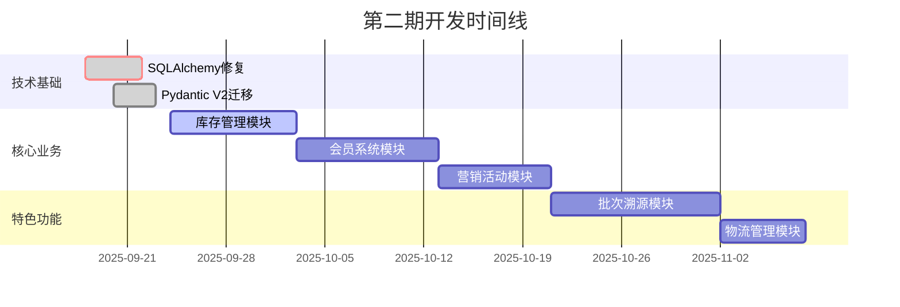

# 第二期开发总体计划

**制定日期**: 2025年9月17日  
**制定人**: GitHub Copilot  
**计划周期**: Phase 2 - 商业化基础建设  
**预估工期**: 4-6周  

## 🎯 第二期开发目标

### 核心目标
基于第一期完成的6个核心模块基础，第二期重点解决：

1. **🔧 技术债务清理** - 解决SQLAlchemy映射器问题，提升系统稳定性
2. **📦 库存管理完善** - 补齐电商核心基础设施，支撑业务扩展
3. **🚀 商业化能力** - 建立会员体系和营销工具，实现商业变现
4. **🌾 农产品特色** - 开发批次溯源功能，构建差异化竞争优势
5. **📱 移动端优化** - 完善移动支付体验，符合农产品消费习惯

### 预期成果
- ✅ 系统技术债务清零，测试全面通过
- ✅ 完整的库存管理体系，支撑精细化运营
- ✅ 基础会员和营销体系，启动商业化运营
- ✅ 农产品溯源MVP，建立行业差异化优势
- ✅ 优化的移动支付体验，提升转化率

## 📋 第二期开发模块清单

### 🔥 P0优先级 - 技术基础修复 (Week 1)
**必须完成，影响系统稳定性**

#### 1. 系统架构优化
- **SQLAlchemy映射器问题修复**
  - 问题: 模块间关系映射配置冲突导致集成测试失败
  - 解决: 重构模型关系定义，统一外键管理
  - 验收: 所有集成测试通过，映射器错误清零
  - 工期: 3-5天

- **Pydantic V2迁移**
  - 问题: Pydantic V1语法兼容性警告
  - 解决: 逐步迁移到V2语法，使用ConfigDict
  - 验收: 清除所有deprecation警告
  - 工期: 2-3天

### 🚀 P1优先级 - 核心业务模块 (Week 2-3)
**商业化基础，启动盈利能力**

#### 2. 库存管理模块 (inventory_management)
**现状**: 已有基础代码框架，需要完善和优化

**核心功能开发**:
- ✅ **库存跟踪** - 实时库存、预占机制、安全库存预警
- ✅ **多仓库支持** - 仓库管理、库存调拨、区域库存
- ✅ **智能补货** - 基于销量预测的补货建议
- ✅ **批次库存** - 批次关联、先进先出、过期预警

**技术要求**:
- 基于现有models.py扩展，保持架构一致性
- 实现高并发库存操作的原子性保证
- 与订单系统紧密集成，支持预占和释放
- 提供库存分析和报表功能

**验收标准**:
- 支持并发库存操作，数据一致性保证
- 与订单系统无缝集成，预占/释放机制稳定
- 库存预警和补货建议准确率>90%
- 完整单元测试覆盖率>95%

**工期**: 8-10天

#### 3. 会员系统模块 (member_system) - 新建
**商业化核心，提升用户价值**

**核心功能开发**:
- ✅ **会员等级体系** - 基于消费金额的等级晋升机制
- ✅ **积分系统** - 积分获得、消费、兑换、有效期管理
- ✅ **会员权益** - 专享价格、优先发货、专属客服
- ✅ **个性化营销** - 会员标签、精准推送、生日特权

**技术要求**:
- 与用户认证系统集成，扩展用户模型
- 设计灵活的积分规则引擎
- 支持多种会员权益和特权管理
- 提供会员数据分析和价值评估

**验收标准**:
- 会员等级自动晋升机制准确
- 积分系统计算无误，支持各种业务场景
- 会员权益生效及时，用户体验良好
- 会员数据分析报表完整

**工期**: 10-12天

#### 4. 营销活动模块 (marketing_campaigns) - 新建
**商业转化核心，提升订单量**

**核心功能开发**:
- ✅ **优惠券系统** - 券码生成、发放规则、使用限制、核销统计
- ✅ **促销活动** - 限时抢购、满减优惠、新人专享、会员专享
- ✅ **活动管理** - 活动创建、审核、执行、效果统计
- ✅ **营销工具** - 营销码、推广链接、效果追踪

**技术要求**:
- 灵活的规则引擎支持复杂营销规则
- 与订单和支付系统集成，自动应用优惠
- 高并发优惠券发放和使用处理
- 实时营销效果统计和ROI分析

**验收标准**:
- 优惠券系统稳定，支持高并发领取和使用
- 营销规则准确执行，无漏洞和异常
- 活动效果数据准确，ROI统计清晰
- 管理后台操作便捷，功能完整

**工期**: 8-10天

### 🌾 P1优先级 - 农产品特色 (Week 4-5)
**差异化竞争优势，行业标杆功能**

#### 5. 批次溯源模块 (batch_traceability) - 新建
**农产品核心差异化功能**

**核心功能开发**:
- ✅ **批次管理** - 生产批次创建、状态跟踪、批次分割合并
- ✅ **溯源记录** - 生产、加工、检测、物流全链路记录
- ✅ **溯源查询** - 消费者扫码查询、管理端溯源分析
- ✅ **质量关联** - 与质量控制模块集成，关联证书和检测报告

**技术要求**:
- 设计完整的溯源数据模型，支持复杂溯源链
- 与质量控制、库存管理、订单系统集成
- 提供便捷的溯源信息录入和管理界面
- 支持二维码生成和扫码查询功能

**验收标准**:
- 溯源链条完整，覆盖从生产到销售全过程
- 与现有系统无缝集成，数据一致性保证
- 消费者查询体验良好，信息展示清晰
- 管理端操作便捷，数据录入高效

**工期**: 12-14天

#### 6. 物流管理模块 (logistics_management) - 简化版
**完善交易闭环，提升用户体验**

**核心功能开发** (简化版，不包含冷链):
- ✅ **配送方式管理** - 标准配送、加急配送、定时配送选项
- ✅ **物流跟踪** - 实时物流状态更新、配送进度查询
- ✅ **运费计算** - 基于重量、距离的运费计算规则
- ✅ **自提服务** - 门店自提、社区自提点管理

**技术要求**:
- 与订单系统集成，自动创建物流订单
- 支持第三方物流API集成（预留接口）
- 简化的物流状态管理和用户通知
- 基础的运费计算和配送区域管理

**验收标准**:
- 物流信息与订单状态同步及时
- 运费计算准确，支持多种配送方式
- 用户查询体验良好，信息更新及时
- 预留扩展接口，支持未来功能升级

**工期**: 6-8天

## 🎯 开发优先级和依赖关系

### 开发顺序规划

### 依赖关系分析
1. **技术基础修复** → 所有其他模块 (阻塞性依赖)
2. **库存管理** → 营销活动、批次溯源 (库存数据依赖)
3. **会员系统** → 营销活动 (会员权益依赖)
4. **批次溯源** → 物流管理 (溯源信息传递依赖)

## 🔧 技术实施策略

### 开发方法论
1. **测试驱动开发 (TDD)**
   - 每个模块先编写完整测试用例
   - 确保新功能不破坏现有功能
   - 维持>95%的测试覆盖率

2. **文档驱动开发 (DDD)**
   - 遵循MASTER.md 7文档标准
   - 每个模块完整文档套件
   - 质量控制模块作为标准参考

3. **迭代式开发**
   - 每个模块按周为单位迭代
   - 每周末进行功能演示和验收
   - 及时调整和优化开发计划

### 技术风险管控
1. **SQLAlchemy映射器问题**
   - 风险: 可能需要大量重构现有模型
   - 缓解: 逐步修复，保持向后兼容
   - 应急: 准备回滚方案

2. **新模块集成复杂度**
   - 风险: 新模块与现有系统集成困难
   - 缓解: 预先设计集成接口，分步骤集成
   - 应急: 简化功能范围，优先核心功能

3. **性能和并发问题**
   - 风险: 库存管理等模块需要处理高并发
   - 缓解: 设计时考虑并发安全，充分测试
   - 应急: 采用分布式锁等技术手段

## 📊 验收标准和成功指标

### 技术指标
- **测试覆盖率**: 每个模块>95%，整体>90%
- **性能指标**: API响应时间<500ms，页面加载<2s
- **稳定性**: 7天连续运行无重大故障
- **代码质量**: 遵循代码规范，通过静态检查

### 业务指标
- **功能完整性**: 所有规划功能按要求实现
- **用户体验**: 核心流程操作简便，错误处理友好
- **数据准确性**: 库存、积分、优惠等计算准确率100%
- **集成稳定性**: 模块间数据传递无丢失和错误

### 文档指标
- **MASTER.md合规**: 6个新模块达到7文档标准
- **API文档**: 所有接口有完整OpenAPI文档
- **部署文档**: 提供完整部署和运维指南

## 🚀 后续规划展望

### 第三期规划 (预览)
基于第二期成果，第三期将重点发展：
- **分销商管理** - 多级分销体系，扩大销售渠道
- **社交功能** - 拼团、分享、推荐等社交电商功能
- **数据分析** - 用户行为分析，精准营销
- **供应商管理** - 供应商协作平台，优化供应链

### 长期技术演进
- **微服务架构** - 根据业务规模逐步拆分服务
- **AI能力** - 智能推荐、智能客服、预测分析
- **区块链溯源** - 不可篡改的溯源证明
- **移动应用** - 原生App开发，提升用户体验

---

## 📝 总结

第二期开发计划聚焦于在第一期稳固基础上，通过技术债务清理、核心业务完善和特色功能建设，建立电商平台的商业化能力和农产品行业差异化优势。

**关键成功因素**:
1. **技术稳定性优先** - 先解决系统技术债务，确保稳定基础
2. **商业价值导向** - 重点建设会员和营销体系，启动商业化
3. **农产品特色** - 通过批次溯源建立行业差异化竞争优势
4. **用户体验至上** - 所有功能以提升用户体验为核心目标

这个计划为农产品电商平台的成功奠定了坚实基础，既解决了技术债务，又建立了商业化能力，同时保持了农产品行业的特色定位。