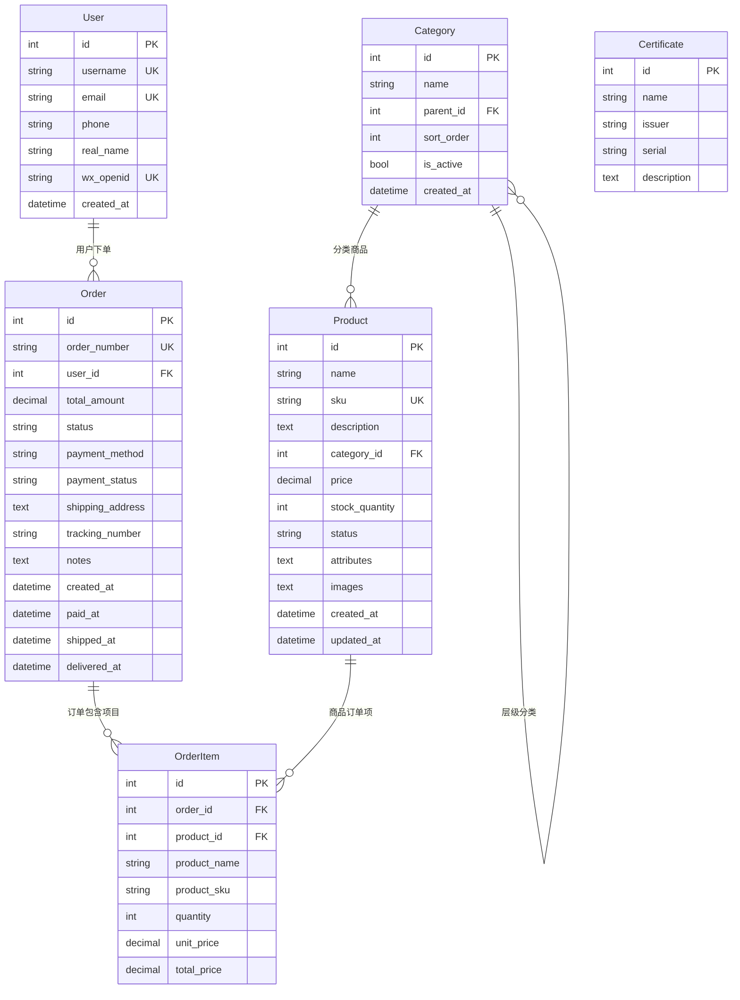

# 数据模型架构文档

## 概述

本文档描述电商平台的数据模型架构，基于 SQLAlchemy 2.x ORM 实现，遵循电商业务领域建模最佳实践。

## 核心实体模型

### 1. User (用户模型)
- **表名**: `users`
- **主要字段**:
  - `id`: 主键，自增整数
  - `username`: 用户名，唯一索引
  - `email`: 邮箱，唯一索引  
  - `phone`: 手机号，可选
  - `real_name`: 真实姓名，可选
  - `wx_openid`: 微信 OpenID，唯一索引，支持微信登录
  - `created_at`: 创建时间，自动设置
- **关系**: 一对多关联到 Order

### 2. Category (分类模型)
- **表名**: `categories`
- **主要字段**:
  - `id`: 主键，自增整数
  - `name`: 分类名称，长度限制 100
  - `parent_id`: 父分类 ID，支持层级分类
  - `sort_order`: 排序权重，默认 0
  - `is_active`: 是否激活，默认 True
  - `created_at`: 创建时间，自动设置
- **索引**: `parent_id`, `sort_order`, `is_active`
- **关系**: 自引用父子关系，一对多关联到 Product

### 3. Product (商品模型)  
- **表名**: `products`
- **主要字段**:
  - `id`: 主键，自增整数
  - `name`: 商品名称，长度限制 200
  - `sku`: 商品 SKU，唯一索引，长度限制 100
  - `description`: 商品描述，文本类型
  - `category_id`: 分类 ID，外键关联 Category
  - `price`: 商品价格，精确到分 (DECIMAL(10,2))
  - `stock_quantity`: 库存数量，默认 0
  - `status`: 商品状态 (active/inactive/out_of_stock)
  - `attributes`: 商品属性，JSON 字符串存储
  - `images`: 商品图片，JSON 字符串存储
  - `created_at/updated_at`: 时间戳
- **索引**: `sku`, `category_id`, `status`, `price`
- **关系**: 多对一关联到 Category，一对多关联到 OrderItem

### 4. Order (订单模型)
- **表名**: `orders`  
- **主要字段**:
  - `id`: 主键，自增整数
  - `order_number`: 订单号，唯一索引
  - `user_id`: 用户 ID，外键关联 User
  - `total_amount`: 订单总金额 (DECIMAL(10,2))
  - `status`: 订单状态 (pending/paid/shipped/delivered/cancelled)
  - `payment_method`: 支付方式 (wechat/alipay/bank_card)
  - `payment_status`: 支付状态 (pending/paid/failed/refunded)
  - `shipping_address`: 收货地址，JSON 字符串
  - `tracking_number`: 物流单号，可选
  - `notes`: 订单备注
  - `created_at`: 创建时间
  - `paid_at/shipped_at/delivered_at`: 状态时间戳
- **索引**: `order_number`, `user_id`, `status`, `payment_status`
- **关系**: 多对一关联到 User，一对多关联到 OrderItem

### 5. OrderItem (订单项模型)
- **表名**: `order_items`
- **主要字段**:
  - `id`: 主键，自增整数
  - `order_id`: 订单 ID，外键关联 Order
  - `product_id`: 商品 ID，外键关联 Product
  - `product_name`: 商品名称快照
  - `product_sku`: 商品 SKU 快照
  - `quantity`: 购买数量
  - `unit_price`: 单价快照 (DECIMAL(10,2))
  - `total_price`: 小计金额 (DECIMAL(10,2))
- **索引**: `order_id`, `product_id`
- **关系**: 多对一关联到 Order 和 Product

### 6. Certificate (证书模型)
- **表名**: `certificates`
- **主要字段**:
  - `id`: 主键，自增整数  
  - `name`: 证书名称
  - `issuer`: 颁发者，可选
  - `serial`: 证书序列号
  - `description`: 证书描述，可选
- **说明**: 保留原有业务模型，向后兼容

## 数据库关系图

## 索引策略

### 性能优化索引
- **User**: `username`, `email`, `wx_openid` (唯一索引)
- **Category**: `parent_id`, `sort_order`, `is_active` (复合索引)
- **Product**: `sku` (唯一), `category_id`, `status`, `price` 
- **Order**: `order_number` (唯一), `user_id`, `status`, `payment_status`
- **OrderItem**: `order_id`, `product_id` (复合索引)

### 外键约束
- `Product.category_id` → `Category.id`
- `Order.user_id` → `User.id`  
- `OrderItem.order_id` → `Order.id`
- `OrderItem.product_id` → `Product.id`
- `Category.parent_id` → `Category.id` (自引用)

## 迁移管理

### 当前迁移状态
- **0001_initial.py**: 完整的电商核心模型初始迁移
- **迁移策略**: 采用手动创建迁移文件，确保迁移链的干净和可控

### 迁移最佳实践
1. 所有结构变更必须通过 Alembic 迁移
2. 禁止直接修改数据库结构
3. 迁移文件必须经过代码审查
4. 生产环境迁移必须先在测试环境验证

## 扩展方向

### 短期扩展
- 商品规格变体 (ProductVariant)
- 购物车 (ShoppingCart) 
- 优惠券 (Coupon)
- 库存日志 (StockLog)

### 长期扩展  
- 多租户支持
- 商品评价系统
- 推荐算法数据
- 数据分析维度表

## 版本记录

- **v1.0** (2025-09-08): 电商核心模型架构建立
- 建立完整的用户、商品、订单、分类业务模型
- 实现微信生态集成准备 (wx_openid)
- 确保数据一致性和性能优化的索引策略
