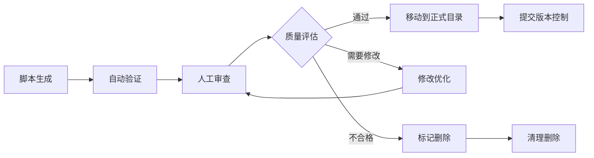

# Generated测试目录管理策略

## 📋 概述

`tests/generated/` 目录用于存放自动生成的测试文件，主要由 `scripts/generate_test_template.py` 工具创建。本文档规范了该目录的管理策略、文件生命周期和质量控制流程。

## 🎯 目录用途定义

### 主要功能
- **测试模板生成**: 存放工具生成的测试模板文件
- **快速原型**: 提供测试开发的起始点
- **架构验证**: 验证五层测试架构的完整性
- **学习参考**: 为新测试编写提供标准示例

### 目录特性
- **临时性质**: 文件应该经过审查后移动到正式目录
- **自动化生成**: 内容由脚本工具自动创建
- **版本无关**: 不应提交到版本控制系统
- **质量待验证**: 需要人工审查和优化

## 📁 目录结构规范

### 标准结构

```
tests/generated/
├── README.md                           # 目录说明文档
├── .gitignore                         # Git忽略配置
├── templates/                         # 生成的测试模板
│   ├── unit/                          # 单元测试模板
│   ├── integration/                   # 集成测试模板
│   ├── e2e/                          # E2E测试模板
│   ├── smoke/                        # 烟雾测试模板
│   └── specialized/                  # 专项测试模板
├── complete/                          # 完整测试套件
│   └── test_<module>_complete.py      # 自动生成的完整测试
├── pending_review/                    # 待审查测试文件
└── archived/                          # 已处理的历史文件
```

### 文件命名规范

```
# 生成的测试文件命名格式
test_<module_name>_<test_type>_generated_<timestamp>.py

# 示例
test_shopping_cart_unit_generated_20250919_223351.py
test_user_auth_integration_generated_20250920_103024.py
test_payment_complete_generated_20250920_144512.py
```

## 🔒 版本控制策略

### GitIgnore配置

在项目根目录 `.gitignore` 文件中添加：

```ignore
# 自动生成的测试文件
tests/generated/
!tests/generated/README.md
!tests/generated/.gitignore

# 临时测试文件
tests/**/test_*_generated_*.py
tests/**/test_*_temp_*.py
tests/**/test_*_draft_*.py

# 测试生成工具的临时文件
scripts/generate_test_template.tmp
scripts/.test_generation_cache/
```

### 版本控制原则

| 文件类型 | 是否提交 | 说明 |
|---------|---------|------|
| **目录结构文件** | ✅ 提交 | README.md, .gitignore 等结构文件 |
| **生成的测试文件** | ❌ 不提交 | 自动生成，内容可能频繁变化 |
| **模板文件** | ❌ 不提交 | 由工具生成，不需要版本控制 |
| **审查通过的文件** | ✅ 移动后提交 | 移动到正式目录后可以提交 |

## 🔄 文件生命周期管理

### 生命周期阶段



### 1. 生成阶段 (Generated)

**触发条件:**
```powershell
# 工具生成触发
python scripts/generate_test_template.py shopping_cart --type all
```

**自动操作:**
- 创建时间戳标记的文件
- 添加生成信息注释
- 基础语法验证
- 文件权限设置

**文件头部信息:**
```python
"""
Shopping Cart Module Tests - Auto Generated

生成时间: 2025-09-20 14:45:12
生成工具: scripts/generate_test_template.py v2.1
基于模块: app.modules.shopping_cart
测试类型: complete (五层架构)
状态: GENERATED - 需要人工审查

警告: 此文件为自动生成，请勿直接使用于生产测试。
     需要经过代码审查、测试验证和质量优化后方可使用。
"""
```

### 2. 验证阶段 (Validated)

**自动验证检查:**
```powershell
# 语法检查
python -m py_compile tests/generated/test_shopping_cart_complete.py

# 导入检查
python -c "import tests.generated.test_shopping_cart_complete"

# 基础结构验证
pytest tests/generated/ --collect-only

# 代码质量检查
flake8 tests/generated/
black --check tests/generated/
```

**验证标准:**
- ✅ Python语法正确
- ✅ 导入依赖可解析
- ✅ pytest能够发现测试
- ✅ 符合代码格式规范
- ✅ 没有明显的逻辑错误

### 3. 审查阶段 (Under Review)

**审查清单:**

**功能性审查:**
- [ ] 测试覆盖率是否符合要求
- [ ] 测试用例是否完整覆盖业务逻辑
- [ ] Mock使用是否合理和准确
- [ ] 断言是否具体和有意义
- [ ] 异常情况是否充分测试

**技术性审查:**
- [ ] 代码结构是否清晰
- [ ] 命名规范是否一致
- [ ] 依赖导入是否正确
- [ ] 测试数据是否合理
- [ ] 性能影响是否可接受

**标准符合性审查:**
- [ ] 是否符合五层测试架构
- [ ] 是否遵循项目测试标准
- [ ] 是否使用统一的测试模式
- [ ] 文档注释是否完整

**审查记录模板:**
```markdown
## 测试文件审查记录

**文件:** `test_shopping_cart_complete.py`
**审查人:** 张三
**审查时间:** 2025-09-20 15:30:00
**生成时间:** 2025-09-20 14:45:12

### 审查结果
- [x] 功能性: 通过
- [x] 技术性: 通过  
- [ ] 标准符合性: 需要修改

### 发现的问题
1. Mock使用过度，建议部分改为真实数据测试
2. 缺少边界条件测试用例
3. 异常处理测试不充分

### 修改建议
1. 在`test_add_item_boundary_conditions`中添加库存不足的测试
2. 增加网络异常情况的Mock测试
3. 补充数据验证失败的测试用例

### 处理决定
- [ ] 直接通过，移动到正式目录
- [x] 需要修改，返回开发者
- [ ] 不符合要求，标记删除

### 备注
总体质量良好，修改后可以使用。建议作为购物车模块测试的基础模板。
```

### 4. 优化阶段 (Optimizing)

**优化操作:**
```powershell
# 代码格式化
black tests/generated/test_shopping_cart_complete.py

# 导入排序
isort tests/generated/test_shopping_cart_complete.py

# 类型检查
mypy tests/generated/test_shopping_cart_complete.py

# 安全检查
bandit tests/generated/test_shopping_cart_complete.py
```

**性能优化:**
- 减少不必要的数据库操作
- 优化Mock对象创建
- 简化复杂的测试逻辑
- 提高测试执行速度

### 5. 迁移阶段 (Migrating)

**迁移检查清单:**
- [ ] 审查已通过
- [ ] 所有优化已完成
- [ ] 测试可以正常执行
- [ ] 覆盖率达到要求
- [ ] 代码质量符合标准

**迁移操作:**
```powershell
# 移动文件到正式目录
Move-Item "tests/generated/test_shopping_cart_complete.py" "tests/unit/test_shopping_cart.py"

# 更新文件头信息
# 移除生成标记，添加正式文档

# 添加到版本控制
git add tests/unit/test_shopping_cart.py
git commit -m "Add shopping cart unit tests (from generated template)"

# 清理原始生成文件
Remove-Item "tests/generated/test_shopping_cart_*" -Force
```

### 6. 清理阶段 (Cleanup)

**定期清理策略:**
```powershell
# 每日清理脚本 (scripts/cleanup_generated_tests.ps1)
# 清理超过7天的未审查文件
Get-ChildItem "tests/generated/" -Filter "*.py" | 
    Where-Object {$_.LastWriteTime -lt (Get-Date).AddDays(-7)} |
    Remove-Item -Force

# 清理空目录
Get-ChildItem "tests/generated/" -Directory | 
    Where-Object {(Get-ChildItem $_.FullName).Count -eq 0} |
    Remove-Item -Force
```

**清理触发条件:**
- 文件生成超过7天未处理
- 文件标记为删除状态
- 磁盘空间不足时
- 月度维护清理

## 🎯 质量控制流程

### 自动化质量检查

**质量检查脚本** (`scripts/validate_generated_tests.py`)

```python
#!/usr/bin/env python3
"""
Generated测试质量检查工具
"""

import os
import ast
import sys
from pathlib import Path
from typing import List, Dict, Any

class GeneratedTestValidator:
    def __init__(self):
        self.issues = []
        self.warnings = []
        
    def validate_file(self, file_path: Path) -> Dict[str, Any]:
        """验证单个测试文件"""
        result = {
            'file': str(file_path),
            'syntax_valid': False,
            'imports_valid': False,
            'tests_found': 0,
            'issues': [],
            'warnings': []
        }
        
        # 语法检查
        try:
            with open(file_path, 'r', encoding='utf-8') as f:
                ast.parse(f.read())
            result['syntax_valid'] = True
        except SyntaxError as e:
            result['issues'].append(f"语法错误: {e}")
            
        # 测试发现检查
        test_count = self._count_test_functions(file_path)
        result['tests_found'] = test_count
        
        if test_count == 0:
            result['warnings'].append("未发现测试函数")
            
        return result
        
    def _count_test_functions(self, file_path: Path) -> int:
        """统计测试函数数量"""
        try:
            with open(file_path, 'r', encoding='utf-8') as f:
                content = f.read()
                tree = ast.parse(content)
                
            count = 0
            for node in ast.walk(tree):
                if isinstance(node, ast.FunctionDef) and node.name.startswith('test_'):
                    count += 1
                    
            return count
        except:
            return 0
```

**执行质量检查:**
```powershell
# 检查所有生成的测试文件
python scripts/validate_generated_tests.py

# 生成质量报告
python scripts/validate_generated_tests.py --report

# 自动修复可修复的问题
python scripts/validate_generated_tests.py --fix
```

### 质量标准

**必须满足的标准:**
- ✅ Python语法正确，无语法错误
- ✅ 所有导入能够正确解析
- ✅ 至少包含1个有效的测试函数
- ✅ 符合PEP8代码格式规范
- ✅ 无明显的安全风险

**推荐达到的标准:**
- ⭐ 测试覆盖率 ≥ 70%
- ⭐ 包含正负案例测试
- ⭐ 合理使用Mock和真实数据
- ⭐ 有意义的断言和错误消息
- ⭐ 完整的文档注释

**优秀标准:**
- 🌟 覆盖率 ≥ 90%
- 🌟 包含边界条件和异常测试
- 🌟 性能测试用例
- 🌟 参数化测试
- 🌟 详细的测试文档

## 🛠️ 管理工具和脚本

### 1. Generated目录管理脚本

**创建管理脚本** (`scripts/manage_generated_tests.ps1`)

```powershell
#!/usr/bin/env pwsh
<#
.SYNOPSIS
Generated测试目录管理工具

.DESCRIPTION
管理tests/generated/目录的文件生命周期，包括清理、审查、迁移等操作

.PARAMETER Action
执行的操作类型: list, clean, review, migrate, stats

.PARAMETER Module
指定要操作的模块名称

.PARAMETER Days
清理操作的天数阈值

.EXAMPLE
.\scripts\manage_generated_tests.ps1 -Action list
.\scripts\manage_generated_tests.ps1 -Action clean -Days 7
.\scripts\manage_generated_tests.ps1 -Action review -Module shopping_cart
#>

param(
    [Parameter(Mandatory=$true)]
    [ValidateSet("list", "clean", "review", "migrate", "stats")]
    [string]$Action,
    
    [string]$Module = "",
    
    [int]$Days = 7
)

function Get-GeneratedTests {
    Get-ChildItem "tests/generated/" -Filter "*.py" -Recurse
}

function Remove-OldTests {
    param([int]$DaysOld)
    
    $cutoffDate = (Get-Date).AddDays(-$DaysOld)
    $oldFiles = Get-GeneratedTests | Where-Object {$_.LastWriteTime -lt $cutoffDate}
    
    foreach ($file in $oldFiles) {
        Write-Host "清理旧文件: $($file.Name)" -ForegroundColor Yellow
        Remove-Item $file.FullName -Force
    }
    
    Write-Host "清理完成，删除了 $($oldFiles.Count) 个文件" -ForegroundColor Green
}

function Show-TestStats {
    $files = Get-GeneratedTests
    $totalFiles = $files.Count
    
    Write-Host "=== Generated测试统计 ===" -ForegroundColor Cyan
    Write-Host "总文件数: $totalFiles"
    
    # 按生成时间分组
    $recent = $files | Where-Object {$_.LastWriteTime -gt (Get-Date).AddDays(-1)}
    $thisWeek = $files | Where-Object {$_.LastWriteTime -gt (Get-Date).AddDays(-7)}
    
    Write-Host "24小时内: $($recent.Count)"
    Write-Host "本周内: $($thisWeek.Count)"
    Write-Host "超过一周: $($totalFiles - $thisWeek.Count)"
}

# 主逻辑
switch ($Action) {
    "list" { 
        Get-GeneratedTests | Format-Table Name, LastWriteTime, Length
    }
    "clean" { 
        Remove-OldTests -DaysOld $Days 
    }
    "stats" { 
        Show-TestStats 
    }
    "review" {
        Write-Host "启动测试审查流程..." -ForegroundColor Green
        if ($Module) {
            $files = Get-GeneratedTests | Where-Object {$_.Name -like "*$Module*"}
        } else {
            $files = Get-GeneratedTests
        }
        
        foreach ($file in $files) {
            Write-Host "审查文件: $($file.Name)" -ForegroundColor Yellow
            # 启动审查流程
            python scripts/validate_generated_tests.py $file.FullName
        }
    }
}
```

### 2. 自动化迁移脚本

**迁移脚本** (`scripts/migrate_generated_test.py`)

```python
#!/usr/bin/env python3
"""
Generated测试文件迁移工具
"""

import os
import shutil
import re
from pathlib import Path
from datetime import datetime

class TestMigrator:
    def __init__(self):
        self.generated_dir = Path("tests/generated/")
        self.target_dirs = {
            "unit": Path("tests/unit/"),
            "integration": Path("tests/integration/"),
            "e2e": Path("tests/e2e/"),
            "smoke": Path("tests/smoke/"),
            "performance": Path("tests/performance/"),
            "security": Path("tests/security/")
        }
        
    def migrate_file(self, source_file: Path, test_type: str, new_name: str = None):
        """迁移测试文件到正式目录"""
        target_dir = self.target_dirs.get(test_type)
        if not target_dir:
            raise ValueError(f"不支持的测试类型: {test_type}")
            
        # 确定目标文件名
        if new_name:
            target_file = target_dir / new_name
        else:
            # 移除生成标记
            clean_name = re.sub(r'_generated_\d{8}_\d{6}', '', source_file.name)
            target_file = target_dir / clean_name
            
        # 检查目标文件是否存在
        if target_file.exists():
            backup_name = f"{target_file.stem}_backup_{datetime.now().strftime('%Y%m%d_%H%M%S')}{target_file.suffix}"
            backup_file = target_file.parent / backup_name
            shutil.move(str(target_file), str(backup_file))
            print(f"已备份现有文件: {backup_file}")
            
        # 复制文件并更新内容
        self._copy_and_clean_file(source_file, target_file)
        
        # 删除原始文件
        source_file.unlink()
        
        print(f"成功迁移: {source_file} -> {target_file}")
        
    def _copy_and_clean_file(self, source: Path, target: Path):
        """复制文件并清理生成标记"""
        with open(source, 'r', encoding='utf-8') as f:
            content = f.read()
            
        # 清理生成标记
        content = self._clean_generated_markers(content)
        
        with open(target, 'w', encoding='utf-8') as f:
            f.write(content)
            
    def _clean_generated_markers(self, content: str) -> str:
        """清理文件中的生成标记"""
        # 移除生成相关的注释
        lines = content.split('\n')
        cleaned_lines = []
        
        skip_block = False
        for line in lines:
            if 'Auto Generated' in line or '生成时间:' in line:
                skip_block = True
            elif skip_block and line.strip() and not line.startswith('#') and not line.startswith('"""'):
                skip_block = False
                cleaned_lines.append(line)
            elif not skip_block:
                cleaned_lines.append(line)
                
        return '\n'.join(cleaned_lines)

if __name__ == "__main__":
    import argparse
    
    parser = argparse.ArgumentParser(description="迁移Generated测试文件")
    parser.add_argument("source_file", help="源文件路径")
    parser.add_argument("test_type", choices=["unit", "integration", "e2e", "smoke", "performance", "security"])
    parser.add_argument("--name", help="目标文件名")
    
    args = parser.parse_args()
    
    migrator = TestMigrator()
    migrator.migrate_file(Path(args.source_file), args.test_type, args.name)
```

## 📊 监控和报告

### 使用统计报告

**统计脚本** (`scripts/generated_tests_stats.py`)

```python
#!/usr/bin/env python3
"""
Generated测试使用统计
"""

def generate_usage_report():
    """生成使用统计报告"""
    report = {
        'generation_count': get_generation_count(),
        'migration_success_rate': get_migration_success_rate(),
        'quality_scores': get_quality_scores(),
        'popular_modules': get_popular_modules()
    }
    
    print("=== Generated测试使用报告 ===")
    print(f"总生成数: {report['generation_count']}")
    print(f"迁移成功率: {report['migration_success_rate']:.1%}")
    print(f"平均质量分: {report['quality_scores']['average']:.1f}")
```

### 性能监控

**监控指标:**
- 文件生成速度
- 质量检查时间
- 迁移成功率
- 存储空间使用
- 清理频率

## 🔗 相关文档

- **[测试脚本手册](testing-scripts-manual.md)** - 生成工具详细说明
- **[测试标准文档](../standards/testing-standards.md)** - 测试架构规范
- **[测试使用指南](testing-usage-guide.md)** - 测试执行说明
- **[代码质量标准](../standards/code-quality.md)** - 代码质量要求
- **[版本控制规范](../standards/version-control.md)** - 版本管理策略