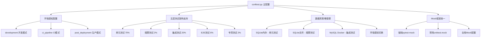
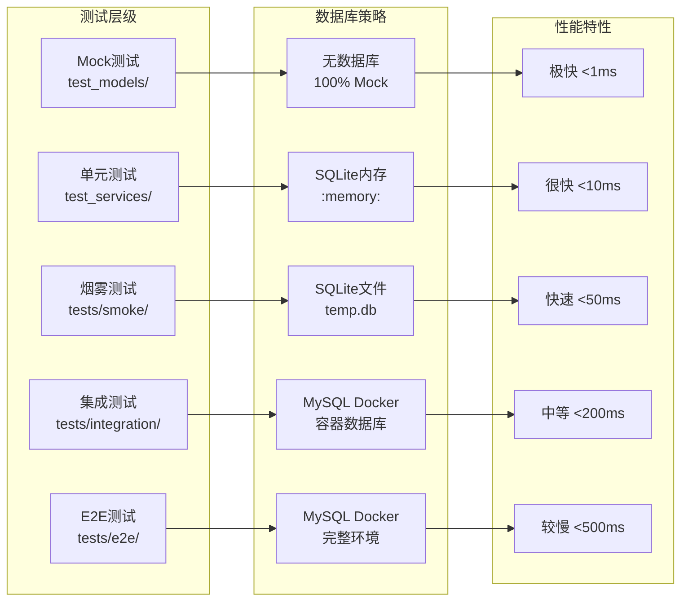
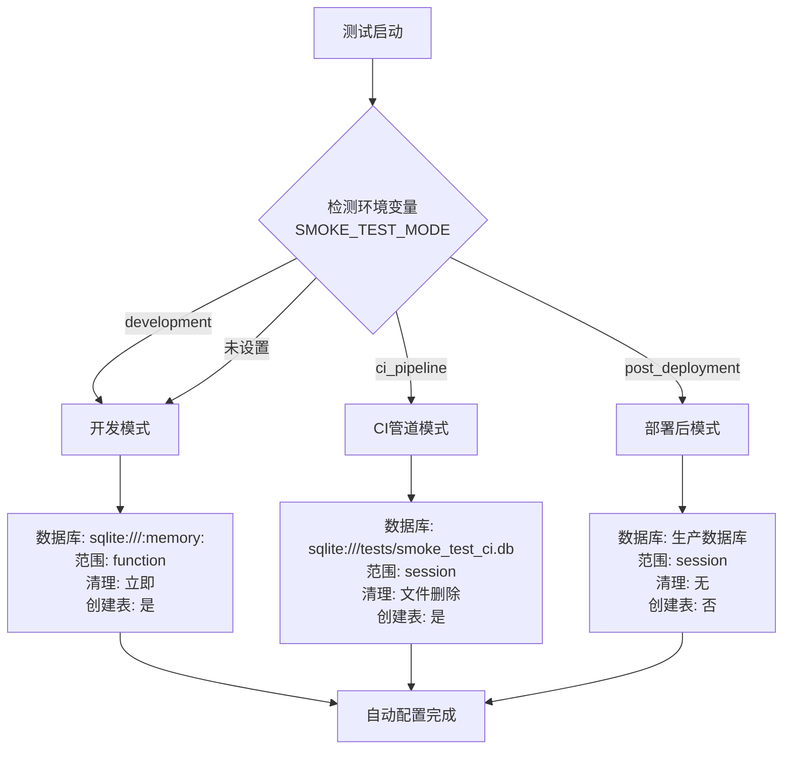
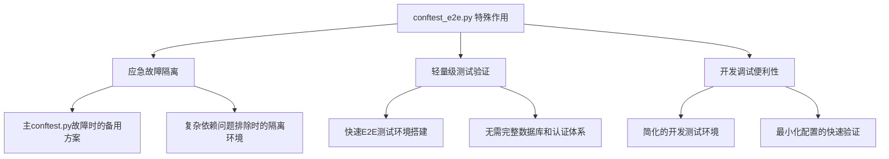
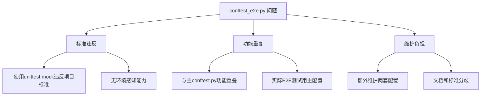

# 测试环境配置分析报告

## 📊 测试配置文件分析结果

### 🎯 测试配置文件对比分析

| 配置文件 | 作用范围 | 复杂度 | 主要功能 | 数据库支持 | Mock支持 |
|---------|----------|--------|----------|------------|----------|
| **conftest.py** | 全项目测试 | 高 (710行) | 完整测试基础设施 | 5种数据库策略 | 完整pytest-mock |
| **conftest_e2e.py** | E2E测试专用 | 低 (50行) | 简化E2E验证 | 仅内存SQLite | 基础Mock工厂 |

### 🏗️ conftest.py 核心架构设计



### 🎛️ 数据库策略分层设计



### 🌍 环境感知配置策略



### 📋 测试标准文档规范对比

| 测试标准要求 | conftest.py实现 | conftest_e2e.py实现 | 符合程度 |
|-------------|----------------|-------------------|----------|
| **五层测试架构** | ✅ 完整支持5个层级 | ❌ 仅支持基础架构 | conftest.py ✅ |
| **数据库策略分层** | ✅ 4种策略完整实现 | ❌ 仅内存数据库 | conftest.py ✅ |
| **pytest-mock统一** | ✅ 强制标准实现 | ❌ 使用unittest.mock | conftest.py ✅ |
| **环境感知配置** | ✅ 3种环境模式 | ❌ 固定配置 | conftest.py ✅ |
| **性能优化** | ✅ SQLite WAL模式等 | ❌ 基础配置 | conftest.py ✅ |

### 🔍 具体配置功能对比

#### conftest.py (主配置文件)
- **行数**: 710行 (复杂度高)
- **环境感知**: ✅ 支持3种模式自动切换
- **数据库策略**: ✅ 支持5种数据库配置
- **Mock框架**: ✅ 强制pytest-mock，禁用unittest.mock
- **清理策略**: ✅ 3种清理模式（立即/文件/无清理）
- **性能优化**: ✅ SQLite WAL模式、外键约束、优化配置
- **认证覆盖**: ✅ 完整的FastAPI依赖注入覆盖
- **测试客户端**: ✅ 多种TestClient配置

#### conftest_e2e.py (E2E专用配置)
- **行数**: 50行 (简化配置)
- **环境感知**: ❌ 固定内存数据库
- **数据库策略**: ❌ 仅SQLite内存数据库
- **Mock框架**: ❌ 使用unittest.mock
- **清理策略**: ❌ 基础会话清理
- **性能优化**: ❌ 无特殊优化
- **认证覆盖**: ❌ 无认证处理
- **测试客户端**: ❌ 无HTTP客户端配置

### 🎯 设计原理分析

#### 1. 为什么需要两个配置文件？

**架构分离原则**:
- **conftest.py**: 承载完整项目的测试基础设施
- **conftest_e2e.py**: 提供简化的E2E测试环境，避免复杂依赖

**使用场景**:
- **conftest.py**: 单元测试、集成测试、烟雾测试、性能测试、安全测试
- **conftest_e2e.py**: 快速E2E验证、避免复杂配置干扰

#### 2. 当前设计存在的问题

**conftest_e2e.py问题**:
- ❌ 使用unittest.mock违反项目标准
- ❌ 缺少环境感知能力
- ❌ 无法支持标准测试架构
- ❌ 配置过于简化，功能不完整

**建议改进**:
- 统一使用pytest-mock
- 添加环境感知配置
- 对接主配置文件的核心功能
- 保持简化但符合标准

### 📊 测试环境配置总结

#### ✅ 优势
1. **conftest.py实现了完整的五层测试架构支持**
2. **环境感知配置实现了开发/CI/生产三种模式**
3. **数据库策略完全符合测试标准文档要求**
4. **Mock框架统一使用pytest-mock**

#### ⚠️  需要改进
1. **conftest_e2e.py需要标准化改造**
2. **文档说明可以更加清晰**
3. **配置复杂度可以进一步优化**

#### 🎯 建议
1. **保留双配置文件架构**，但统一标准
2. **conftest_e2e.py改造为符合标准的简化版本**
3. **增强文档说明两个配置文件的具体使用场景**

## 🤔 conftest_e2e.py 保留价值分析

### 📋 当前实际使用情况

#### ❌ **真实使用情况检查**
1. **E2E测试目录状态**: `tests/e2e/` 目录仅有 README.md，无实际测试文件
2. **代码引用检查**: 仅在 `tools/e2e_test_verification.py` 中被动态创建
3. **Fixture使用情况**: 无任何测试文件实际使用其提供的 fixtures
4. **标准符合度**: 违反项目pytest-mock统一标准

#### 🎯 **设计初衷分析**
根据git历史和代码分析，conftest_e2e.py 的创建目的：

1. **应急隔离机制**: 在主conftest.py过于复杂时提供简化替代
2. **E2E测试验证工具**: 为 `e2e_test_verification.py` 提供轻量级环境
3. **快速测试启动**: 避免主配置文件的复杂依赖加载

### 🔍 **特殊作用深度分析**

#### ✅ **潜在价值**


#### ❌ **实际问题**


### 📊 **保留 vs 删除对比分析**

| 维度 | 保留conftest_e2e.py | 删除conftest_e2e.py |
|------|-------------------|-------------------|
| **标准一致性** | ❌ 继续违反pytest-mock标准 | ✅ 统一使用主配置标准 |
| **维护成本** | ❌ 需要维护两套配置 | ✅ 只维护一套配置 |
| **应急价值** | ✅ 提供故障隔离机制 | ❌ 失去应急备用方案 |
| **开发便利** | ✅ 快速简化测试环境 | ❌ 必须使用完整配置 |
| **架构清晰** | ❌ 双配置增加复杂性 | ✅ 单一配置更清晰 |

### 🎯 **建议策略**

#### 方案1: **标准化改造保留** (推荐)
```python
# 改造后的conftest_e2e.py
"""
简化E2E测试配置 - 符合项目标准的轻量级版本
提供快速测试环境，保持与主配置的标准一致性
"""
import pytest
from tests.conftest import get_smoke_test_config

@pytest.fixture(scope="session")
def simple_test_db():
    """简化数据库配置，使用主配置的环境感知机制"""
    # 使用主配置的环境感知，但简化为内存数据库
    config = get_smoke_test_config()
    engine = create_engine("sqlite:///:memory:")
    # ... 其他配置

@pytest.fixture
def mock_factory(mocker):  # 使用pytest-mock
    """符合标准的Mock工厂"""
    return mocker.Mock()
```

**优势**:
- ✅ 保留应急隔离和快速验证价值
- ✅ 符合项目pytest-mock标准
- ✅ 继承主配置的环境感知能力
- ✅ 维护成本可控

#### 方案2: **完全删除**
```bash
# 删除文件并更新相关引用
rm tests/conftest_e2e.py
# 修改 tools/e2e_test_verification.py 使用主配置
# 更新文档和标准
```

**优势**:
- ✅ 彻底统一配置标准
- ✅ 简化项目架构
- ✅ 减少维护负担

**劣势**:
- ❌ 失去应急隔离机制
- ❌ 复杂环境问题时缺少简化调试手段

### 🏆 **最终建议**

**推荐方案1**: **标准化改造保留**

**理由**:
1. **应急价值确实存在**: 当主配置文件出现复杂依赖问题时，简化配置有助于问题隔离
2. **开发便利性**: 某些快速验证场景下，轻量级配置更高效
3. **标准化成本可控**: 只需要修改Mock使用方式和添加环境感知即可
4. **架构灵活性**: 保持简化和完整两种配置选择

**改造重点**:
- 统一使用pytest-mock
- 添加基础环境感知
- 对接主配置的核心功能
- 保持简化但符合标准